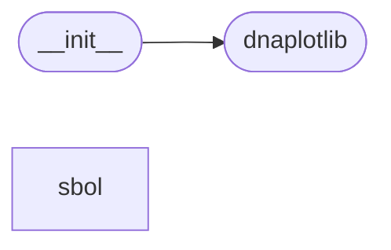

# Code Overview

[_Documentation generated by Documatic_](https://www.documatic.com)

<!---Documatic-section-Codebase Structure Python-start--->
## Codebase Structure Python

The codebase has a single-depth folder structure,
                with 4 code files in total.

<!---Documatic-block-system_architecture-start--->

<!---Documatic-block-system_architecture-end--->

# #
<!---Documatic-section-Codebase Structure Python-end--->

<!---Documatic-section-Key Objects-start--->
## Key Objects

There are exposed imports at level-0
from the source directory (dnaplotlib)

<!---Documatic-block-dnaplotlib-start--->

	
<code>dnaplotlib</code> (Click to Expand!)

* `dnaplotlib.dnaplotlib.DNARenderer`
* `dnaplotlib.dnaplotlib.__author__`
* `dnaplotlib.dnaplotlib.__license__`
* `dnaplotlib.dnaplotlib.__version__`
* `dnaplotlib.dnaplotlib.connect`
* `dnaplotlib.dnaplotlib.convert_attrib`
* `dnaplotlib.dnaplotlib.dpl_default_type_map`
* `dnaplotlib.dnaplotlib.induce`
* `dnaplotlib.dnaplotlib.load_design_from_gff`
* `dnaplotlib.dnaplotlib.load_profile_from_bed`
* `dnaplotlib.dnaplotlib.plot_sbol_designs`
* `dnaplotlib.dnaplotlib.regulation`
* `dnaplotlib.dnaplotlib.repress`
* `dnaplotlib.dnaplotlib.save_sbol_designs`
* `dnaplotlib.dnaplotlib.sbol_3_chromosomal_locus`
* `dnaplotlib.dnaplotlib.sbol_3_overhang`
* `dnaplotlib.dnaplotlib.sbol_3_sticky_restriction_site`
* `dnaplotlib.dnaplotlib.sbol_5_chromosomal_locus`
* `dnaplotlib.dnaplotlib.sbol_5_overhang`
* `dnaplotlib.dnaplotlib.sbol_5_sticky_restriction_site`
* `dnaplotlib.dnaplotlib.sbol_blunt_restriction_site`
* `dnaplotlib.dnaplotlib.sbol_cds`
* `dnaplotlib.dnaplotlib.sbol_empty_space`
* `dnaplotlib.dnaplotlib.sbol_insulator`
* `dnaplotlib.dnaplotlib.sbol_operator`
* `dnaplotlib.dnaplotlib.sbol_origin`
* `dnaplotlib.dnaplotlib.sbol_primer_binding_site`
* `dnaplotlib.dnaplotlib.sbol_promoter`
* `dnaplotlib.dnaplotlib.sbol_rbs`
* `dnaplotlib.dnaplotlib.sbol_restriction_site`
* `dnaplotlib.dnaplotlib.sbol_ribozyme`
* `dnaplotlib.dnaplotlib.sbol_scar`
* `dnaplotlib.dnaplotlib.sbol_signature`
* `dnaplotlib.dnaplotlib.sbol_spacer`
* `dnaplotlib.dnaplotlib.sbol_stem_top`
* `dnaplotlib.dnaplotlib.sbol_terminator`
* `dnaplotlib.dnaplotlib.sbol_user_defined`
* `dnaplotlib.dnaplotlib.stick_figure`
* `dnaplotlib.dnaplotlib.temporary_repressor`
* `dnaplotlib.dnaplotlib.trace_cds`
* `dnaplotlib.dnaplotlib.trace_promoter`
* `dnaplotlib.dnaplotlib.trace_promoter_start`
* `dnaplotlib.dnaplotlib.trace_rbs`
* `dnaplotlib.dnaplotlib.trace_terminator`
* `dnaplotlib.dnaplotlib.trace_user_defined`
* `dnaplotlib.dnaplotlib.write_label`

<!---Documatic-block-dnaplotlib-end--->

# #
<!---Documatic-section-Key Objects-end--->

<!---Documatic-section-Important Functions-start--->
## Important Functions

<!---Documatic-block-important_funcs-start--->
<!---Documatic-block-most_used_funcs-start--->
### Most Utilised Functions

* dnaplotlib.dnaplotlib.__author__ (1 times)
* dnaplotlib.dnaplotlib.__license__ (1 times)
* dnaplotlib.dnaplotlib.__version__ (1 times)
* [dnaplotlib.dnaplotlib.connect](3-dnaplotlib_dnaplotlib.md#dnaplotlib.dnaplotlib.connect) (1 times)
* [dnaplotlib.dnaplotlib.convert_attrib](3-dnaplotlib_dnaplotlib.md#dnaplotlib.dnaplotlib.convert_attrib) (1 times)
* dnaplotlib.dnaplotlib.dpl_default_type_map (1 times)
* [dnaplotlib.dnaplotlib.induce](3-dnaplotlib_dnaplotlib.md#dnaplotlib.dnaplotlib.induce) (1 times)
* [dnaplotlib.dnaplotlib.load_design_from_gff](3-dnaplotlib_dnaplotlib.md#dnaplotlib.dnaplotlib.load_design_from_gff) (1 times)
* [dnaplotlib.dnaplotlib.load_profile_from_bed](3-dnaplotlib_dnaplotlib.md#dnaplotlib.dnaplotlib.load_profile_from_bed) (1 times)
* [dnaplotlib.dnaplotlib.plot_sbol_designs](3-dnaplotlib_dnaplotlib.md#dnaplotlib.dnaplotlib.plot_sbol_designs) (1 times)
* [dnaplotlib.dnaplotlib.regulation](3-dnaplotlib_dnaplotlib.md#dnaplotlib.dnaplotlib.regulation) (1 times)
* [dnaplotlib.dnaplotlib.repress](3-dnaplotlib_dnaplotlib.md#dnaplotlib.dnaplotlib.repress) (1 times)
* [dnaplotlib.dnaplotlib.save_sbol_designs](3-dnaplotlib_dnaplotlib.md#dnaplotlib.dnaplotlib.save_sbol_designs) (1 times)
* [dnaplotlib.dnaplotlib.sbol_3_chromosomal_locus](3-dnaplotlib_dnaplotlib.md#dnaplotlib.dnaplotlib.sbol_3_chromosomal_locus) (1 times)
* [dnaplotlib.dnaplotlib.sbol_3_overhang](3-dnaplotlib_dnaplotlib.md#dnaplotlib.dnaplotlib.sbol_3_overhang) (1 times)
* [dnaplotlib.dnaplotlib.sbol_3_sticky_restriction_site](3-dnaplotlib_dnaplotlib.md#dnaplotlib.dnaplotlib.sbol_3_sticky_restriction_site) (1 times)
* [dnaplotlib.dnaplotlib.sbol_5_chromosomal_locus](3-dnaplotlib_dnaplotlib.md#dnaplotlib.dnaplotlib.sbol_5_chromosomal_locus) (1 times)
* [dnaplotlib.dnaplotlib.sbol_5_overhang](3-dnaplotlib_dnaplotlib.md#dnaplotlib.dnaplotlib.sbol_5_overhang) (1 times)
* [dnaplotlib.dnaplotlib.sbol_5_sticky_restriction_site](3-dnaplotlib_dnaplotlib.md#dnaplotlib.dnaplotlib.sbol_5_sticky_restriction_site) (1 times)
* [dnaplotlib.dnaplotlib.sbol_blunt_restriction_site](3-dnaplotlib_dnaplotlib.md#dnaplotlib.dnaplotlib.sbol_blunt_restriction_site) (1 times)
* [dnaplotlib.dnaplotlib.sbol_cds](3-dnaplotlib_dnaplotlib.md#dnaplotlib.dnaplotlib.sbol_cds) (1 times)
* [dnaplotlib.dnaplotlib.sbol_empty_space](3-dnaplotlib_dnaplotlib.md#dnaplotlib.dnaplotlib.sbol_empty_space) (1 times)
* [dnaplotlib.dnaplotlib.sbol_insulator](3-dnaplotlib_dnaplotlib.md#dnaplotlib.dnaplotlib.sbol_insulator) (1 times)
* [dnaplotlib.dnaplotlib.sbol_operator](3-dnaplotlib_dnaplotlib.md#dnaplotlib.dnaplotlib.sbol_operator) (1 times)
* [dnaplotlib.dnaplotlib.sbol_origin](3-dnaplotlib_dnaplotlib.md#dnaplotlib.dnaplotlib.sbol_origin) (1 times)
<!---Documatic-block-most_used_funcs-end--->

<!---Documatic-block-end_user_funcs-start--->
### End User Exposed Functions

* [dnaplotlib.dnaplotlib.trace_user_defined](3-dnaplotlib_dnaplotlib.md#dnaplotlib.dnaplotlib.trace_user_defined)
* [dnaplotlib.dnaplotlib.regulation](3-dnaplotlib_dnaplotlib.md#dnaplotlib.dnaplotlib.regulation)
* [dnaplotlib.dnaplotlib.sbol_5_sticky_restriction_site](3-dnaplotlib_dnaplotlib.md#dnaplotlib.dnaplotlib.sbol_5_sticky_restriction_site)
* [dnaplotlib.dnaplotlib.sbol_ribozyme](3-dnaplotlib_dnaplotlib.md#dnaplotlib.dnaplotlib.sbol_ribozyme)
* [dnaplotlib.dnaplotlib.sbol_operator](3-dnaplotlib_dnaplotlib.md#dnaplotlib.dnaplotlib.sbol_operator)
* [dnaplotlib.dnaplotlib.save_sbol_designs](3-dnaplotlib_dnaplotlib.md#dnaplotlib.dnaplotlib.save_sbol_designs)
* [dnaplotlib.dnaplotlib.sbol_insulator](3-dnaplotlib_dnaplotlib.md#dnaplotlib.dnaplotlib.sbol_insulator)
* [dnaplotlib.dnaplotlib.sbol_spacer](3-dnaplotlib_dnaplotlib.md#dnaplotlib.dnaplotlib.sbol_spacer)
* [dnaplotlib.dnaplotlib.sbol_promoter](3-dnaplotlib_dnaplotlib.md#dnaplotlib.dnaplotlib.sbol_promoter)
* [dnaplotlib.dnaplotlib.sbol_cds](3-dnaplotlib_dnaplotlib.md#dnaplotlib.dnaplotlib.sbol_cds)
* [dnaplotlib.dnaplotlib.temporary_repressor](3-dnaplotlib_dnaplotlib.md#dnaplotlib.dnaplotlib.temporary_repressor)
* [dnaplotlib.dnaplotlib.trace_promoter](3-dnaplotlib_dnaplotlib.md#dnaplotlib.dnaplotlib.trace_promoter)
* [dnaplotlib.dnaplotlib.trace_promoter_start](3-dnaplotlib_dnaplotlib.md#dnaplotlib.dnaplotlib.trace_promoter_start)
* dnaplotlib.dnaplotlib.__license__
* [dnaplotlib.dnaplotlib.sbol_origin](3-dnaplotlib_dnaplotlib.md#dnaplotlib.dnaplotlib.sbol_origin)
* [dnaplotlib.dnaplotlib.load_design_from_gff](3-dnaplotlib_dnaplotlib.md#dnaplotlib.dnaplotlib.load_design_from_gff)
* [dnaplotlib.dnaplotlib.sbol_empty_space](3-dnaplotlib_dnaplotlib.md#dnaplotlib.dnaplotlib.sbol_empty_space)
* [dnaplotlib.dnaplotlib.sbol_5_chromosomal_locus](3-dnaplotlib_dnaplotlib.md#dnaplotlib.dnaplotlib.sbol_5_chromosomal_locus)
* [dnaplotlib.dnaplotlib.convert_attrib](3-dnaplotlib_dnaplotlib.md#dnaplotlib.dnaplotlib.convert_attrib)
* [dnaplotlib.dnaplotlib.sbol_terminator](3-dnaplotlib_dnaplotlib.md#dnaplotlib.dnaplotlib.sbol_terminator)
* [dnaplotlib.dnaplotlib.trace_cds](3-dnaplotlib_dnaplotlib.md#dnaplotlib.dnaplotlib.trace_cds)
* [dnaplotlib.dnaplotlib.write_label](3-dnaplotlib_dnaplotlib.md#dnaplotlib.dnaplotlib.write_label)
* [dnaplotlib.dnaplotlib.sbol_signature](3-dnaplotlib_dnaplotlib.md#dnaplotlib.dnaplotlib.sbol_signature)
* dnaplotlib.dnaplotlib.dpl_default_type_map
* [dnaplotlib.dnaplotlib.load_profile_from_bed](3-dnaplotlib_dnaplotlib.md#dnaplotlib.dnaplotlib.load_profile_from_bed)
* [dnaplotlib.dnaplotlib.sbol_stem_top](3-dnaplotlib_dnaplotlib.md#dnaplotlib.dnaplotlib.sbol_stem_top)
* [dnaplotlib.dnaplotlib.sbol_scar](3-dnaplotlib_dnaplotlib.md#dnaplotlib.dnaplotlib.sbol_scar)
* [dnaplotlib.dnaplotlib.sbol_5_overhang](3-dnaplotlib_dnaplotlib.md#dnaplotlib.dnaplotlib.sbol_5_overhang)
* [dnaplotlib.dnaplotlib.sbol_restriction_site](3-dnaplotlib_dnaplotlib.md#dnaplotlib.dnaplotlib.sbol_restriction_site)
* [dnaplotlib.dnaplotlib.trace_terminator](3-dnaplotlib_dnaplotlib.md#dnaplotlib.dnaplotlib.trace_terminator)
* dnaplotlib.dnaplotlib.__author__
* [dnaplotlib.dnaplotlib.sbol_primer_binding_site](3-dnaplotlib_dnaplotlib.md#dnaplotlib.dnaplotlib.sbol_primer_binding_site)
* [dnaplotlib.dnaplotlib.DNARenderer](3-dnaplotlib_dnaplotlib.md#dnaplotlib.dnaplotlib.DNARenderer)
* [dnaplotlib.dnaplotlib.induce](3-dnaplotlib_dnaplotlib.md#dnaplotlib.dnaplotlib.induce)
* [dnaplotlib.dnaplotlib.sbol_3_overhang](3-dnaplotlib_dnaplotlib.md#dnaplotlib.dnaplotlib.sbol_3_overhang)
* [dnaplotlib.dnaplotlib.sbol_3_sticky_restriction_site](3-dnaplotlib_dnaplotlib.md#dnaplotlib.dnaplotlib.sbol_3_sticky_restriction_site)
* [dnaplotlib.dnaplotlib.plot_sbol_designs](3-dnaplotlib_dnaplotlib.md#dnaplotlib.dnaplotlib.plot_sbol_designs)
* [dnaplotlib.dnaplotlib.repress](3-dnaplotlib_dnaplotlib.md#dnaplotlib.dnaplotlib.repress)
* [dnaplotlib.dnaplotlib.sbol_blunt_restriction_site](3-dnaplotlib_dnaplotlib.md#dnaplotlib.dnaplotlib.sbol_blunt_restriction_site)
* [dnaplotlib.dnaplotlib.sbol_rbs](3-dnaplotlib_dnaplotlib.md#dnaplotlib.dnaplotlib.sbol_rbs)
* [dnaplotlib.dnaplotlib.stick_figure](3-dnaplotlib_dnaplotlib.md#dnaplotlib.dnaplotlib.stick_figure)
* dnaplotlib.dnaplotlib.__version__
* [dnaplotlib.dnaplotlib.connect](3-dnaplotlib_dnaplotlib.md#dnaplotlib.dnaplotlib.connect)
* [dnaplotlib.dnaplotlib.sbol_user_defined](3-dnaplotlib_dnaplotlib.md#dnaplotlib.dnaplotlib.sbol_user_defined)
* [dnaplotlib.dnaplotlib.trace_rbs](3-dnaplotlib_dnaplotlib.md#dnaplotlib.dnaplotlib.trace_rbs)
* [dnaplotlib.dnaplotlib.sbol_3_chromosomal_locus](3-dnaplotlib_dnaplotlib.md#dnaplotlib.dnaplotlib.sbol_3_chromosomal_locus)
<!---Documatic-block-end_user_funcs-end--->
<!---Documatic-block-important_funcs-end--->

# #
<!---Documatic-section-Important Functions-end--->

<!---Documatic-section-File IO-start--->
## File IO

<!---Documatic-block-file_io-start--->
The following files have file read operations

<!---Documatic-block-dnaplotlib-start--->

	
<code>dnaplotlib</code> (Click to Expand!)

* dnaplotlib.dnaplotlib

<!---Documatic-block-dnaplotlib-end--->
<!---Documatic-block-file_io-end--->

# #
<!---Documatic-section-File IO-end--->

<!---Documatic-section-Class Hierarchy-start--->
## Class Hierarchy

<!---Documatic-block-dpl.DNARenderer-start--->

	
<code>dpl.DNARenderer</code> (Click to Expand!)

* dnaplotlib.sbol.sbolplotlib.SBOLRenderer

<!---Documatic-block-dpl.DNARenderer-end--->

# #
<!---Documatic-section-Class Hierarchy-end--->

[_Documentation generated by Documatic_](https://www.documatic.com)