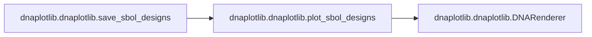

# Dnaplotlib Dnaplotlib

[_Documentation generated by Documatic_](https://www.documatic.com)

<!---Documatic-section-Codebase Structure-start--->
## Codebase Structure

<!---Documatic-block-system_architecture-start--->
```mermaid
None
```
<!---Documatic-block-system_architecture-end--->

# #
<!---Documatic-section-Codebase Structure-end--->

<!---Documatic-section-dnaplotlib.dnaplotlib.connect-start--->
## [dnaplotlib.dnaplotlib.connect](3-dnaplotlib_dnaplotlib.md#dnaplotlib.dnaplotlib.connect)

<!---Documatic-section-connect-start--->


### Object Calls

* [dnaplotlib.dnaplotlib.regulation](3-dnaplotlib_dnaplotlib.md#dnaplotlib.dnaplotlib.regulation)

<!---Documatic-block-dnaplotlib.dnaplotlib.connect-start--->
<details>
	<summary><code>dnaplotlib.dnaplotlib.connect</code> code snippet</summary>

```python
def connect(ax, type, num, from_part, to_part, scale, linewidth, arc_height_index, opts):
    regulation(ax, type, num, from_part, to_part, scale, linewidth, arc_height_index, opts)
```
</details>
<!---Documatic-block-dnaplotlib.dnaplotlib.connect-end--->
<!---Documatic-section-connect-end--->

# #
<!---Documatic-section-dnaplotlib.dnaplotlib.connect-end--->

<!---Documatic-section-dnaplotlib.dnaplotlib.convert_attrib-start--->
## [dnaplotlib.dnaplotlib.convert_attrib](3-dnaplotlib_dnaplotlib.md#dnaplotlib.dnaplotlib.convert_attrib)

<!---Documatic-section-convert_attrib-start--->
<!---Documatic-block-dnaplotlib.dnaplotlib.convert_attrib-start--->
<details>
	<summary><code>dnaplotlib.dnaplotlib.convert_attrib</code> code snippet</summary>

```python
def convert_attrib(attrib):
    if attrib[0] == '(' and attrib[-1] == ')' and (len(attrib.split(',')) == 3):
        col_parts = attrib[1:-1].split(',')
        new_col = (float(col_parts[0]), float(col_parts[1]), float(col_parts[2]))
        return new_col
    if attrib[0] == '(' and attrib[-1] == ')' and (len(attrib.split(',')) == 4):
        col_parts = attrib[1:-1].split(',')
        new_col = (float(col_parts[0]), float(col_parts[1]), float(col_parts[2]), float(col_parts[3]))
        return new_col
    try:
        return float(attrib)
    except ValueError:
        return attrib
```
</details>
<!---Documatic-block-dnaplotlib.dnaplotlib.convert_attrib-end--->
<!---Documatic-section-convert_attrib-end--->

# #
<!---Documatic-section-dnaplotlib.dnaplotlib.convert_attrib-end--->

<!---Documatic-section-dnaplotlib.dnaplotlib.induce-start--->
## [dnaplotlib.dnaplotlib.induce](3-dnaplotlib_dnaplotlib.md#dnaplotlib.dnaplotlib.induce)

<!---Documatic-section-induce-start--->


### Object Calls

* [dnaplotlib.dnaplotlib.regulation](3-dnaplotlib_dnaplotlib.md#dnaplotlib.dnaplotlib.regulation)

<!---Documatic-block-dnaplotlib.dnaplotlib.induce-start--->
<details>
	<summary><code>dnaplotlib.dnaplotlib.induce</code> code snippet</summary>

```python
def induce(ax, type, num, from_part, to_part, scale, linewidth, arc_height_index, opts):
    regulation(ax, type, num, from_part, to_part, scale, linewidth, arc_height_index, opts)
```
</details>
<!---Documatic-block-dnaplotlib.dnaplotlib.induce-end--->
<!---Documatic-section-induce-end--->

# #
<!---Documatic-section-dnaplotlib.dnaplotlib.induce-end--->

<!---Documatic-section-dnaplotlib.dnaplotlib.load_design_from_gff-start--->
## [dnaplotlib.dnaplotlib.load_design_from_gff](3-dnaplotlib_dnaplotlib.md#dnaplotlib.dnaplotlib.load_design_from_gff)

<!---Documatic-section-load_design_from_gff-start--->


### Object Calls

* [dnaplotlib.dnaplotlib.convert_attrib](3-dnaplotlib_dnaplotlib.md#dnaplotlib.dnaplotlib.convert_attrib)

<!---Documatic-block-dnaplotlib.dnaplotlib.load_design_from_gff-start--->
<details>
	<summary><code>dnaplotlib.dnaplotlib.load_design_from_gff</code> code snippet</summary>

```python
def load_design_from_gff(filename, chrom, type_map=dpl_default_type_map, region=None):
    gff = []
    data_reader = csv.reader(open(filename, 'rU'), delimiter='\t')
    for row in data_reader:
        if len(row) == 9:
            cur_chrom = row[0]
            part_type = row[2]
            start_bp = int(row[3])
            end_bp = int(row[4])
            part_dir = row[6]
            part_attribs = {}
            split_attribs = row[8].split(';')
            part_name = None
            for attrib in split_attribs:
                key_value = attrib.split('=')
                if len(key_value) == 2:
                    if key_value[0] == 'Name':
                        part_name = key_value[1]
                    else:
                        part_attribs[key_value[0]] = convert_attrib(key_value[1])
            if part_name != None and cur_chrom == chrom and (part_type in list(type_map.keys())):
                if region != None and (start_bp > region[0] and start_bp < region[1]):
                    gff.append([part_name, type_map[part_type], part_dir, start_bp, end_bp, part_attribs])
    design = []
    for gff_el in sorted(gff, key=itemgetter(3)):
        new_part = {}
        new_part['name'] = gff_el[0]
        new_part['type'] = gff_el[1]
        if gff_el[2] == '+':
            new_part['fwd'] = True
        else:
            new_part['fwd'] = False
        new_part['start'] = gff_el[3]
        new_part['end'] = gff_el[4]
        new_part['opts'] = gff_el[5]
        design.append(new_part)
    return design
```
</details>
<!---Documatic-block-dnaplotlib.dnaplotlib.load_design_from_gff-end--->
<!---Documatic-section-load_design_from_gff-end--->

# #
<!---Documatic-section-dnaplotlib.dnaplotlib.load_design_from_gff-end--->

<!---Documatic-section-dnaplotlib.dnaplotlib.load_profile_from_bed-start--->
## [dnaplotlib.dnaplotlib.load_profile_from_bed](3-dnaplotlib_dnaplotlib.md#dnaplotlib.dnaplotlib.load_profile_from_bed)

<!---Documatic-section-load_profile_from_bed-start--->
<!---Documatic-block-dnaplotlib.dnaplotlib.load_profile_from_bed-start--->
<details>
	<summary><code>dnaplotlib.dnaplotlib.load_profile_from_bed</code> code snippet</summary>

```python
def load_profile_from_bed(filename, chrom, region):
    region_len = region[1] - region[0]
    profile = [0] * region_len
    data_reader = csv.reader(open(filename, 'rU'), delimiter='\t')
    for row in data_reader:
        if len(row) == 5:
            cur_chrom = row[0]
            cur_start_bp = int(row[1])
            cur_end_bp = int(row[2])
            if cur_start_bp == region[0] and cur_end_bp == region[1]:
                profile[int(row[3]) - 1] = float(row[4])
    return profile
```
</details>
<!---Documatic-block-dnaplotlib.dnaplotlib.load_profile_from_bed-end--->
<!---Documatic-section-load_profile_from_bed-end--->

# #
<!---Documatic-section-dnaplotlib.dnaplotlib.load_profile_from_bed-end--->

<!---Documatic-section-dnaplotlib.dnaplotlib.plot_sbol_designs-start--->
## [dnaplotlib.dnaplotlib.plot_sbol_designs](3-dnaplotlib_dnaplotlib.md#dnaplotlib.dnaplotlib.plot_sbol_designs)

<!---Documatic-section-plot_sbol_designs-start--->


### Object Calls

* [dnaplotlib.dnaplotlib.DNARenderer](3-dnaplotlib_dnaplotlib.md#dnaplotlib.dnaplotlib.DNARenderer)

<!---Documatic-block-dnaplotlib.dnaplotlib.plot_sbol_designs-start--->
<details>
	<summary><code>dnaplotlib.dnaplotlib.plot_sbol_designs</code> code snippet</summary>

```python
def plot_sbol_designs(axes, dna_designs, regulations=None, plot_params={}, plot_names=None):
    if 'axis_y' not in list(plot_params.keys()):
        plot_params['axis_y'] = 35
    left_pad = 0.0
    right_pad = 0.0
    scale = 1.0
    linewidth = 1.0
    fig_y = 5.0
    fig_x = 5.0
    if 'backbone_pad_left' in list(plot_params.keys()):
        left_pad = plot_params['backbone_pad_left']
    if 'backbone_pad_right' in list(plot_params.keys()):
        right_pad = plot_params['backbone_pad_right']
    if 'scale' in list(plot_params.keys()):
        scale = plot_params['scale']
    if 'linewidth' in list(plot_params.keys()):
        linewidth = plot_params['linewidth']
    dr = DNARenderer(scale=scale, linewidth=linewidth, backbone_pad_left=left_pad, backbone_pad_right=right_pad)
    reg_renderers = dr.std_reg_renderers()
    part_renderers = dr.SBOL_part_renderers()
    num_of_designs = len(dna_designs)
    max_dna_len = 0.0
    for i in range(num_of_designs):
        regs = None
        if regulations != None:
            regs = regulations[i]
        design = dna_designs[i]
        ax = axes[i]
        if plot_names != None:
            ax.set_title(plot_names[i], fontsize=8)
        (start, end) = dr.renderDNA(ax, design, part_renderers, regs, reg_renderers)
        dna_len = end - start
        if max_dna_len < dna_len:
            max_dna_len = dna_len
    for ax in axes:
        ax.set_xticks([])
        ax.set_yticks([])
        ax.set_xlim([-0.01 * max_dna_len - left_pad, max_dna_len + 0.01 * max_dna_len + right_pad])
        ax.set_ylim([-plot_params['axis_y'], plot_params['axis_y']])
        ax.set_aspect('equal')
        ax.set_axis_off()
    return (max_dna_len, [-0.01 * max_dna_len - left_pad, max_dna_len + 0.01 * max_dna_len + right_pad], [-plot_params['axis_y'], plot_params['axis_y']])
```
</details>
<!---Documatic-block-dnaplotlib.dnaplotlib.plot_sbol_designs-end--->
<!---Documatic-section-plot_sbol_designs-end--->

# #
<!---Documatic-section-dnaplotlib.dnaplotlib.plot_sbol_designs-end--->

<!---Documatic-section-dnaplotlib.dnaplotlib.regulation-start--->
## [dnaplotlib.dnaplotlib.regulation](3-dnaplotlib_dnaplotlib.md#dnaplotlib.dnaplotlib.regulation)

<!---Documatic-section-regulation-start--->
<!---Documatic-block-dnaplotlib.dnaplotlib.regulation-start--->
<details>
	<summary><code>dnaplotlib.dnaplotlib.regulation</code> code snippet</summary>

```python
def regulation(ax, type, num, from_part, to_part, scale, linewidth, arc_height_index, opts):
    color = (0.0, 0.0, 0.0)
    arrowhead_length = 3
    linestyle = '-'
    arcHeightConst = 15
    arcHeightSpacing = 5
    arcHeightStart = 10
    arcHeight = arcHeightConst + arc_height_index * arcHeightSpacing
    arcHeightEnd = arcHeightStart * 1.5
    arc_start_x_offset = 0.0
    arc_end_x_offset = 0.0
    if opts != None:
        if 'arrowhead_length' in list(opts.keys()):
            arrowhead_length = opts['arrowhead_length']
        if 'linestyle' in list(opts.keys()):
            linestyle = opts['linestyle']
        if 'linewidth' in list(opts.keys()):
            linewidth = opts['linewidth']
        if 'color' in list(opts.keys()):
            color = opts['color']
        if 'arc_height' in list(opts.keys()):
            arcHeight = opts['arc_height']
        if 'arc_height_const' in list(opts.keys()):
            arcHeightConst = opts['arc_height_const']
        if 'arc_height_spacing' in list(opts.keys()):
            arcHeightSpacing = opts['arc_height_spacing']
        if 'arc_height_start' in list(opts.keys()):
            arcHeightStart = opts['arc_height_start']
        if 'arc_height_end' in list(opts.keys()):
            arcHeightEnd = opts['arc_height_end']
        if 'arc_start_x_offset' in list(opts.keys()):
            arc_start_x_offset = opts['arc_start_x_offset']
        if 'arc_end_x_offset' in list(opts.keys()):
            arc_end_x_offset = opts['arc_end_x_offset']
    if opts == None or 'arc_height' not in list(opts.keys()):
        arcHeight = arcHeightConst + arc_height_index * arcHeightSpacing
    startHeight = arcHeightStart
    start = (from_part['start'] + from_part['end']) / 2 + arc_start_x_offset
    end = (to_part['start'] + to_part['end']) / 2 + arc_end_x_offset
    top = arcHeight
    base = startHeight
    indHeight = arrowhead_length
    corr = linewidth
    if to_part['fwd'] == False:
        base = -1 * startHeight
        arcHeightEnd = -arcHeightEnd
        top = -1 * arcHeight
        indHeight = -1 * arrowhead_length
        corr *= -1
    line_away = Line2D([start, start], [base, top], linewidth=linewidth, color=color, zorder=12, linestyle=linestyle)
    line_across = Line2D([start, end], [top, top], linewidth=linewidth, color=color, zorder=12, linestyle=linestyle)
    line_toward = Line2D([end, end], [top, arcHeightEnd + corr], linewidth=linewidth, color=color, zorder=12, linestyle=linestyle)
    line_rep = Line2D([end - arrowhead_length, end + arrowhead_length], [arcHeightEnd, arcHeightEnd], linewidth=linewidth, color=color, zorder=12, linestyle='-')
    line_ind1 = Line2D([end - arrowhead_length, end], [arcHeightEnd + indHeight, arcHeightEnd], linewidth=linewidth, color=color, zorder=12, linestyle='-')
    line_ind2 = Line2D([end + arrowhead_length, end], [arcHeightEnd + indHeight, arcHeightEnd], linewidth=linewidth, color=color, zorder=12, linestyle='-')
    if type == 'Repression':
        ax.add_line(line_rep)
        ax.add_line(line_away)
        ax.add_line(line_across)
        ax.add_line(line_toward)
    if type == 'Activation':
        ax.add_line(line_ind1)
        ax.add_line(line_ind2)
        ax.add_line(line_away)
        ax.add_line(line_across)
        ax.add_line(line_toward)
    if type == 'Connection':
        verts = [(start, base), (start, top), (end, top), (end, base)]
        codes = [Path.MOVETO, Path.CURVE4, Path.CURVE4, Path.CURVE4]
        path1 = Path(verts, codes)
        patch = patches.PathPatch(path1, facecolor='none', lw=linewidth, edgecolor=color)
        ax.add_patch(patch)
```
</details>
<!---Documatic-block-dnaplotlib.dnaplotlib.regulation-end--->
<!---Documatic-section-regulation-end--->

# #
<!---Documatic-section-dnaplotlib.dnaplotlib.regulation-end--->

<!---Documatic-section-dnaplotlib.dnaplotlib.repress-start--->
## [dnaplotlib.dnaplotlib.repress](3-dnaplotlib_dnaplotlib.md#dnaplotlib.dnaplotlib.repress)

<!---Documatic-section-repress-start--->


### Object Calls

* [dnaplotlib.dnaplotlib.regulation](3-dnaplotlib_dnaplotlib.md#dnaplotlib.dnaplotlib.regulation)

<!---Documatic-block-dnaplotlib.dnaplotlib.repress-start--->
<details>
	<summary><code>dnaplotlib.dnaplotlib.repress</code> code snippet</summary>

```python
def repress(ax, type, num, from_part, to_part, scale, linewidth, arc_height_index, opts):
    regulation(ax, type, num, from_part, to_part, scale, linewidth, arc_height_index, opts)
```
</details>
<!---Documatic-block-dnaplotlib.dnaplotlib.repress-end--->
<!---Documatic-section-repress-end--->

# #
<!---Documatic-section-dnaplotlib.dnaplotlib.repress-end--->

<!---Documatic-section-dnaplotlib.dnaplotlib.save_sbol_designs-start--->
## [dnaplotlib.dnaplotlib.save_sbol_designs](3-dnaplotlib_dnaplotlib.md#dnaplotlib.dnaplotlib.save_sbol_designs)

<!---Documatic-section-save_sbol_designs-start--->


### Object Calls

* [dnaplotlib.dnaplotlib.plot_sbol_designs](3-dnaplotlib_dnaplotlib.md#dnaplotlib.dnaplotlib.plot_sbol_designs)

<!---Documatic-block-dnaplotlib.dnaplotlib.save_sbol_designs-start--->
<details>
	<summary><code>dnaplotlib.dnaplotlib.save_sbol_designs</code> code snippet</summary>

```python
def save_sbol_designs(filename, dna_designs, regulations=None, plot_params={}, plot_names=None):
    fig = plt.figure(figsize=(10, 10))
    fig.patch.set_facecolor('white')
    axes = []
    for i in range(len(dna_designs)):
        ax = fig.add_subplot(len(dna_designs), 1, i + 1, axisbg='white')
        axes.append(ax)
    (max_dna_len, lims, params) = plot_sbol_designs(axes, dna_designs, regulations=regulations, plot_params=plot_params, plot_names=plot_names)
    fig_x_dim = max_dna_len / 70.0
    if fig_x_dim < 1.0:
        fig_x_dim = 1.0
    fig_y_dim = 1.2 * len(axes)
    plt.gcf().set_size_inches((fig_x_dim, fig_y_dim))
    plt.tight_layout()
    fig.savefig(filename, transparent=True, dpi=300)
    plt.close('all')
```
</details>
<!---Documatic-block-dnaplotlib.dnaplotlib.save_sbol_designs-end--->
<!---Documatic-section-save_sbol_designs-end--->

# #
<!---Documatic-section-dnaplotlib.dnaplotlib.save_sbol_designs-end--->

<!---Documatic-section-dnaplotlib.dnaplotlib.sbol_3_chromosomal_locus-start--->
## [dnaplotlib.dnaplotlib.sbol_3_chromosomal_locus](3-dnaplotlib_dnaplotlib.md#dnaplotlib.dnaplotlib.sbol_3_chromosomal_locus)

<!---Documatic-section-sbol_3_chromosomal_locus-start--->


### Object Calls

* [dnaplotlib.dnaplotlib.write_label](3-dnaplotlib_dnaplotlib.md#dnaplotlib.dnaplotlib.write_label)

<!---Documatic-block-dnaplotlib.dnaplotlib.sbol_3_chromosomal_locus-start--->
<details>
	<summary><code>dnaplotlib.dnaplotlib.sbol_3_chromosomal_locus</code> code snippet</summary>

```python
def sbol_3_chromosomal_locus(ax, type, num, start, end, prev_end, scale, linewidth, opts):
    zorder_add = 0.0
    color = (0, 0, 0)
    start_pad = 2.0
    end_pad = 0.0
    y_extent = 7.5
    x_extent = 18.0
    linestyle = '-'
    dashed_end = True
    if opts != None:
        if 'zorder_add' in list(opts.keys()):
            zorder_add = opts['zorder_add']
        if 'color' in list(opts.keys()):
            color = opts['color']
        if 'start_pad' in list(opts.keys()):
            start_pad = opts['start_pad']
        if 'end_pad' in list(opts.keys()):
            end_pad = opts['end_pad']
        if 'x_extent' in list(opts.keys()):
            x_extent = opts['x_extent']
        if 'y_extent' in list(opts.keys()):
            y_extent = opts['y_extent']
        if 'linestyle' in list(opts.keys()):
            linestyle = opts['linestyle']
        if 'linewidth' in list(opts.keys()):
            linewidth = opts['linewidth']
        if 'scale' in list(opts.keys()):
            scale = opts['scale']
        if 'dashed_end' in list(opts.keys()):
            dashed_end = opts['dashed_end']
    if start > end:
        temp_end = end
        end = start
        start = temp_end
    final_start = prev_end
    start = prev_end + start_pad
    end = start + x_extent
    final_end = end + end_pad
    s_extent = x_extent * 0.67
    t_extent = x_extent - s_extent
    ty = y_extent * 0.23
    sx = s_extent * 0.32
    sy = (y_extent - ty) * 0.4
    sd = (y_extent - 2 * sy - ty) / (s_extent - 2 * sx) * sx
    sdt = ty / (x_extent - sx) * sx
    t_slope = ty / (x_extent - sx)
    if dashed_end:
        tail_code = 1
    else:
        tail_code = 2
    s_path = Path(vertices=[[start, 0], [start + s_extent - sx, 0], [start + s_extent, 0], [start + s_extent, -(sy - sd)], [start + s_extent - sx, -sy], [start + sx, -(y_extent - sy - ty)], [start, -(y_extent - sy - ty + sd)], [start, -(y_extent - ty - sdt)], [start + sx, -(y_extent - ty)], [end - t_extent, -(y_extent - t_extent * t_slope)], [end - t_extent * 5 / 6.0, -(y_extent - t_extent * 5 / 6.0 * t_slope)], [end - t_extent * 4 / 6.0, -(y_extent - t_extent * 4 / 6.0 * t_slope)], [end - t_extent * 3 / 6.0, -(y_extent - t_extent * 3 / 6.0 * t_slope)], [end - t_extent * 2 / 6.0, -(y_extent - t_extent * 2 / 6.0 * t_slope)], [end - t_extent * 1 / 6.0, -(y_extent - t_extent * 1 / 6.0 * t_slope)], [end, -y_extent]], codes=[1, 2, 4, 4, 4, 2, 4, 4, 4, 2, tail_code, 2, tail_code, 2, tail_code, 2])
    s_patch = PathPatch(s_path, linewidth=linewidth, edgecolor=color, facecolor='none', zorder=12 + zorder_add, linestyle=linestyle)
    ax.add_patch(s_patch)
    p1 = Polygon([(start, y_extent), (start, -y_extent), (end, -y_extent), (end, y_extent)], edgecolor=(1, 1, 1), facecolor=(1, 1, 1), linewidth=0, zorder=11 + zorder_add, path_effects=[Stroke(joinstyle='miter')])
    ax.add_patch(p1)
    if opts != None and 'label' in list(opts.keys()):
        write_label(ax, opts['label'], final_start + (final_end - final_start) / 2.0, opts=opts)
    return (final_start, final_end)
```
</details>
<!---Documatic-block-dnaplotlib.dnaplotlib.sbol_3_chromosomal_locus-end--->
<!---Documatic-section-sbol_3_chromosomal_locus-end--->

# #
<!---Documatic-section-dnaplotlib.dnaplotlib.sbol_3_chromosomal_locus-end--->

<!---Documatic-section-dnaplotlib.dnaplotlib.sbol_3_overhang-start--->
## [dnaplotlib.dnaplotlib.sbol_3_overhang](3-dnaplotlib_dnaplotlib.md#dnaplotlib.dnaplotlib.sbol_3_overhang)

<!---Documatic-section-sbol_3_overhang-start--->


### Object Calls

* [dnaplotlib.dnaplotlib.write_label](3-dnaplotlib_dnaplotlib.md#dnaplotlib.dnaplotlib.write_label)

<!---Documatic-block-dnaplotlib.dnaplotlib.sbol_3_overhang-start--->
<details>
	<summary><code>dnaplotlib.dnaplotlib.sbol_3_overhang</code> code snippet</summary>

```python
def sbol_3_overhang(ax, type, num, start, end, prev_end, scale, linewidth, opts):
    zorder_add = 0.0
    color = (0, 0, 0)
    start_pad = 2.0
    end_pad = 0.0
    x_extent = 6.0
    y_extent = 1.0
    linestyle = '-'
    if opts != None:
        if 'zorder_add' in list(opts.keys()):
            zorder_add = opts['zorder_add']
        if 'color' in list(opts.keys()):
            color = opts['color']
        if 'start_pad' in list(opts.keys()):
            start_pad = opts['start_pad']
        if 'end_pad' in list(opts.keys()):
            end_pad = opts['end_pad']
        if 'x_extent' in list(opts.keys()):
            x_extent = opts['x_extent']
        if 'y_extent' in list(opts.keys()):
            y_extent = opts['y_extent']
        if 'linestyle' in list(opts.keys()):
            linestyle = opts['linestyle']
        if 'linewidth' in list(opts.keys()):
            linewidth = opts['linewidth']
        if 'scale' in list(opts.keys()):
            scale = opts['scale']
    final_end = end
    final_start = prev_end
    start = prev_end + start_pad
    end = start + x_extent
    final_end = end + end_pad
    l_top = Line2D([start, start + x_extent], [y_extent, y_extent], linewidth=linewidth, color=color, zorder=12 + zorder_add, linestyle=linestyle)
    l_bottom = Line2D([start, start + x_extent / 2.0], [-1 * y_extent, -1 * y_extent], linewidth=linewidth, color=color, zorder=12 + zorder_add, linestyle=linestyle)
    p1 = Polygon([(start, y_extent), (start, -y_extent), (start + x_extent, -y_extent), (start + x_extent, y_extent)], edgecolor=(1, 1, 1), facecolor=(1, 1, 1), linewidth=linewidth, zorder=11 + zorder_add, path_effects=[Stroke(joinstyle='miter')])
    ax.add_patch(p1)
    ax.add_line(l_top)
    ax.add_line(l_bottom)
    if opts != None and 'label' in list(opts.keys()):
        if final_start > final_end:
            write_label(ax, opts['label'], final_end + (final_start - final_end) / 2.0, opts=opts)
        else:
            write_label(ax, opts['label'], final_start + (final_end - final_start) / 2.0, opts=opts)
    if final_start > final_end:
        return (prev_end, final_start)
    else:
        return (prev_end, final_end)
```
</details>
<!---Documatic-block-dnaplotlib.dnaplotlib.sbol_3_overhang-end--->
<!---Documatic-section-sbol_3_overhang-end--->

# #
<!---Documatic-section-dnaplotlib.dnaplotlib.sbol_3_overhang-end--->

<!---Documatic-section-dnaplotlib.dnaplotlib.sbol_3_sticky_restriction_site-start--->
## [dnaplotlib.dnaplotlib.sbol_3_sticky_restriction_site](3-dnaplotlib_dnaplotlib.md#dnaplotlib.dnaplotlib.sbol_3_sticky_restriction_site)

<!---Documatic-section-sbol_3_sticky_restriction_site-start--->


### Object Calls

* [dnaplotlib.dnaplotlib.write_label](3-dnaplotlib_dnaplotlib.md#dnaplotlib.dnaplotlib.write_label)

<!---Documatic-block-dnaplotlib.dnaplotlib.sbol_3_sticky_restriction_site-start--->
<details>
	<summary><code>dnaplotlib.dnaplotlib.sbol_3_sticky_restriction_site</code> code snippet</summary>

```python
def sbol_3_sticky_restriction_site(ax, type, num, start, end, prev_end, scale, linewidth, opts):
    zorder_add = 0.0
    color = (0, 0, 0)
    start_pad = 2.0
    end_pad = 2.0
    y_extent = 4.0
    x_extent = 8.0
    end_space = 1.0
    linestyle = '-'
    if opts != None:
        if 'zorder_add' in list(opts.keys()):
            zorder_add = opts['zorder_add']
        if 'color' in list(opts.keys()):
            color = opts['color']
        if 'end_space' in list(opts.keys()):
            end_space = opts['end_space']
        if 'start_pad' in list(opts.keys()):
            start_pad = opts['start_pad']
        if 'end_pad' in list(opts.keys()):
            end_pad = opts['end_pad']
        if 'x_extent' in list(opts.keys()):
            x_extent = opts['x_extent']
        if 'y_extent' in list(opts.keys()):
            y_extent = opts['y_extent']
        if 'linestyle' in list(opts.keys()):
            linestyle = opts['linestyle']
        if 'linewidth' in list(opts.keys()):
            linewidth = opts['linewidth']
        if 'scale' in list(opts.keys()):
            scale = opts['scale']
    if start > end:
        temp_end = end
        end = start
        start = temp_end
    final_end = end
    final_start = prev_end
    start = prev_end + start_pad
    end = start + end_space + x_extent + end_space
    final_end = end + end_pad
    l1 = Line2D([start + end_space, start + end_space + x_extent], [0, 0], linewidth=linewidth, color=color, zorder=12 + zorder_add, linestyle=linestyle)
    l1_top = Line2D([start + end_space + x_extent, start + end_space + x_extent], [0, y_extent], linewidth=linewidth, color=color, zorder=12 + zorder_add, linestyle=linestyle)
    l1_bottom = Line2D([start + end_space, start + end_space], [0, -y_extent], linewidth=linewidth, color=color, zorder=12 + zorder_add, linestyle=linestyle)
    ax.add_line(l1)
    ax.add_line(l1_top)
    ax.add_line(l1_bottom)
    p1 = Polygon([(start, y_extent), (start, -y_extent), (end, -y_extent), (end, y_extent)], edgecolor=(1, 1, 1), facecolor=(1, 1, 1), linewidth=linewidth, zorder=11 + zorder_add, path_effects=[Stroke(joinstyle='miter')])
    ax.add_patch(p1)
    if opts != None and 'label' in list(opts.keys()):
        write_label(ax, opts['label'], final_start + (final_end - final_start) / 2.0, opts=opts)
    return (final_start, final_end)
```
</details>
<!---Documatic-block-dnaplotlib.dnaplotlib.sbol_3_sticky_restriction_site-end--->
<!---Documatic-section-sbol_3_sticky_restriction_site-end--->

# #
<!---Documatic-section-dnaplotlib.dnaplotlib.sbol_3_sticky_restriction_site-end--->

<!---Documatic-section-dnaplotlib.dnaplotlib.sbol_5_chromosomal_locus-start--->
## [dnaplotlib.dnaplotlib.sbol_5_chromosomal_locus](3-dnaplotlib_dnaplotlib.md#dnaplotlib.dnaplotlib.sbol_5_chromosomal_locus)

<!---Documatic-section-sbol_5_chromosomal_locus-start--->


### Object Calls

* [dnaplotlib.dnaplotlib.write_label](3-dnaplotlib_dnaplotlib.md#dnaplotlib.dnaplotlib.write_label)

<!---Documatic-block-dnaplotlib.dnaplotlib.sbol_5_chromosomal_locus-start--->
<details>
	<summary><code>dnaplotlib.dnaplotlib.sbol_5_chromosomal_locus</code> code snippet</summary>

```python
def sbol_5_chromosomal_locus(ax, type, num, start, end, prev_end, scale, linewidth, opts):
    zorder_add = 0.0
    color = (0, 0, 0)
    start_pad = 0.0
    end_pad = 2.0
    y_extent = 7.5
    x_extent = 18.0
    linestyle = '-'
    dashed_end = True
    if opts != None:
        if 'zorder_add' in list(opts.keys()):
            zorder_add = opts['zorder_add']
        if 'color' in list(opts.keys()):
            color = opts['color']
        if 'start_pad' in list(opts.keys()):
            start_pad = opts['start_pad']
        if 'end_pad' in list(opts.keys()):
            end_pad = opts['end_pad']
        if 'x_extent' in list(opts.keys()):
            x_extent = opts['x_extent']
        if 'y_extent' in list(opts.keys()):
            y_extent = opts['y_extent']
        if 'linestyle' in list(opts.keys()):
            linestyle = opts['linestyle']
        if 'linewidth' in list(opts.keys()):
            linewidth = opts['linewidth']
        if 'scale' in list(opts.keys()):
            scale = opts['scale']
        if 'dashed_end' in list(opts.keys()):
            dashed_end = opts['dashed_end']
    if start > end:
        temp_end = end
        end = start
        start = temp_end
    final_start = prev_end
    start = prev_end + start_pad
    end = start + x_extent
    final_end = end + end_pad
    s_extent = x_extent * 0.67
    t_extent = x_extent - s_extent
    ty = y_extent * 0.23
    sx = s_extent * 0.32
    sy = (y_extent - ty) * 0.4
    sd = (y_extent - 2 * sy - ty) / (s_extent - 2 * sx) * sx
    sdt = ty / (x_extent - sx) * sx
    t_slope = ty / (x_extent - sx)
    if dashed_end:
        tail_code = 1
    else:
        tail_code = 2
    s_path = Path(vertices=[[end, 0], [end - s_extent + sx, 0], [end - s_extent, 0], [end - s_extent, -(sy - sd)], [end - s_extent + sx, -sy], [end - sx, -(y_extent - sy - ty)], [end, -(y_extent - sy - ty + sd)], [end, -(y_extent - ty - sdt)], [end - sx, -(y_extent - ty)], [start + t_extent, -(y_extent - t_extent * t_slope)], [start + t_extent * 5 / 6.0, -(y_extent - t_extent * 5 / 6.0 * t_slope)], [start + t_extent * 4 / 6.0, -(y_extent - t_extent * 4 / 6.0 * t_slope)], [start + t_extent * 3 / 6.0, -(y_extent - t_extent * 3 / 6.0 * t_slope)], [start + t_extent * 2 / 6.0, -(y_extent - t_extent * 2 / 6.0 * t_slope)], [start + t_extent * 1 / 6.0, -(y_extent - t_extent * 1 / 6.0 * t_slope)], [start, -y_extent]], codes=[1, 2, 4, 4, 4, 2, 4, 4, 4, 2, tail_code, 2, tail_code, 2, tail_code, 2])
    s_patch = PathPatch(s_path, linewidth=linewidth, edgecolor=color, facecolor='none', zorder=12 + zorder_add, linestyle=linestyle)
    ax.add_patch(s_patch)
    p1 = Polygon([(start, y_extent), (start, -y_extent), (end, -y_extent), (end, y_extent)], edgecolor=(1, 1, 1), facecolor=(1, 1, 1), linewidth=0, zorder=11 + zorder_add, path_effects=[Stroke(joinstyle='miter')])
    ax.add_patch(p1)
    if opts != None and 'label' in list(opts.keys()):
        write_label(ax, opts['label'], final_start + (final_end - final_start) / 2.0, opts=opts)
    return (final_start, final_end)
```
</details>
<!---Documatic-block-dnaplotlib.dnaplotlib.sbol_5_chromosomal_locus-end--->
<!---Documatic-section-sbol_5_chromosomal_locus-end--->

# #
<!---Documatic-section-dnaplotlib.dnaplotlib.sbol_5_chromosomal_locus-end--->

<!---Documatic-section-dnaplotlib.dnaplotlib.sbol_5_overhang-start--->
## [dnaplotlib.dnaplotlib.sbol_5_overhang](3-dnaplotlib_dnaplotlib.md#dnaplotlib.dnaplotlib.sbol_5_overhang)

<!---Documatic-section-sbol_5_overhang-start--->


### Object Calls

* [dnaplotlib.dnaplotlib.write_label](3-dnaplotlib_dnaplotlib.md#dnaplotlib.dnaplotlib.write_label)

<!---Documatic-block-dnaplotlib.dnaplotlib.sbol_5_overhang-start--->
<details>
	<summary><code>dnaplotlib.dnaplotlib.sbol_5_overhang</code> code snippet</summary>

```python
def sbol_5_overhang(ax, type, num, start, end, prev_end, scale, linewidth, opts):
    zorder_add = 0.0
    color = (0, 0, 0)
    start_pad = 0.0
    end_pad = 2.0
    x_extent = 6.0
    y_extent = 1.0
    linestyle = '-'
    if opts != None:
        if 'zorder_add' in list(opts.keys()):
            zorder_add = opts['zorder_add']
        if 'color' in list(opts.keys()):
            color = opts['color']
        if 'start_pad' in list(opts.keys()):
            start_pad = opts['start_pad']
        if 'end_pad' in list(opts.keys()):
            end_pad = opts['end_pad']
        if 'x_extent' in list(opts.keys()):
            x_extent = opts['x_extent']
        if 'y_extent' in list(opts.keys()):
            y_extent = opts['y_extent']
        if 'linestyle' in list(opts.keys()):
            linestyle = opts['linestyle']
        if 'linewidth' in list(opts.keys()):
            linewidth = opts['linewidth']
        if 'scale' in list(opts.keys()):
            scale = opts['scale']
    final_end = end
    final_start = prev_end
    start = prev_end + start_pad
    end = start + x_extent
    final_end = end + end_pad
    l_top = Line2D([start, start + x_extent], [y_extent, y_extent], linewidth=linewidth, color=color, zorder=12 + zorder_add, linestyle=linestyle)
    l_bottom = Line2D([start + x_extent / 2.0, start + x_extent], [-1 * y_extent, -1 * y_extent], linewidth=linewidth, color=color, zorder=12 + zorder_add, linestyle=linestyle)
    p1 = Polygon([(start, y_extent), (start, -y_extent), (start + x_extent, -y_extent), (start + x_extent, y_extent)], edgecolor=(1, 1, 1), facecolor=(1, 1, 1), linewidth=linewidth, zorder=11 + zorder_add, path_effects=[Stroke(joinstyle='miter')])
    ax.add_patch(p1)
    ax.add_line(l_top)
    ax.add_line(l_bottom)
    if opts != None and 'label' in list(opts.keys()):
        if final_start > final_end:
            write_label(ax, opts['label'], final_end + (final_start - final_end) / 2.0, opts=opts)
        else:
            write_label(ax, opts['label'], final_start + (final_end - final_start) / 2.0, opts=opts)
    if final_start > final_end:
        return (prev_end, final_start)
    else:
        return (prev_end, final_end)
```
</details>
<!---Documatic-block-dnaplotlib.dnaplotlib.sbol_5_overhang-end--->
<!---Documatic-section-sbol_5_overhang-end--->

# #
<!---Documatic-section-dnaplotlib.dnaplotlib.sbol_5_overhang-end--->

<!---Documatic-section-dnaplotlib.dnaplotlib.sbol_5_sticky_restriction_site-start--->
## [dnaplotlib.dnaplotlib.sbol_5_sticky_restriction_site](3-dnaplotlib_dnaplotlib.md#dnaplotlib.dnaplotlib.sbol_5_sticky_restriction_site)

<!---Documatic-section-sbol_5_sticky_restriction_site-start--->


### Object Calls

* [dnaplotlib.dnaplotlib.write_label](3-dnaplotlib_dnaplotlib.md#dnaplotlib.dnaplotlib.write_label)

<!---Documatic-block-dnaplotlib.dnaplotlib.sbol_5_sticky_restriction_site-start--->
<details>
	<summary><code>dnaplotlib.dnaplotlib.sbol_5_sticky_restriction_site</code> code snippet</summary>

```python
def sbol_5_sticky_restriction_site(ax, type, num, start, end, prev_end, scale, linewidth, opts):
    zorder_add = 0.0
    color = (0, 0, 0)
    start_pad = 2.0
    end_pad = 2.0
    y_extent = 4.0
    x_extent = 8.0
    end_space = 1.0
    linestyle = '-'
    if opts != None:
        if 'zorder_add' in list(opts.keys()):
            zorder_add = opts['zorder_add']
        if 'color' in list(opts.keys()):
            color = opts['color']
        if 'end_space' in list(opts.keys()):
            end_space = opts['end_space']
        if 'start_pad' in list(opts.keys()):
            start_pad = opts['start_pad']
        if 'end_pad' in list(opts.keys()):
            end_pad = opts['end_pad']
        if 'x_extent' in list(opts.keys()):
            x_extent = opts['x_extent']
        if 'y_extent' in list(opts.keys()):
            y_extent = opts['y_extent']
        if 'linestyle' in list(opts.keys()):
            linestyle = opts['linestyle']
        if 'linewidth' in list(opts.keys()):
            linewidth = opts['linewidth']
        if 'scale' in list(opts.keys()):
            scale = opts['scale']
    if start > end:
        temp_end = end
        end = start
        start = temp_end
    final_end = end
    final_start = prev_end
    start = prev_end + start_pad
    end = start + end_space + x_extent + end_space
    final_end = end + end_pad
    l1 = Line2D([start + end_space, start + end_space + x_extent], [0, 0], linewidth=linewidth, color=color, zorder=12 + zorder_add, linestyle=linestyle)
    l1_top = Line2D([start + end_space, start + end_space], [0, y_extent], linewidth=linewidth, color=color, zorder=12 + zorder_add, linestyle=linestyle)
    l1_bottom = Line2D([start + end_space + x_extent, start + end_space + x_extent], [0, -y_extent], linewidth=linewidth, color=color, zorder=12 + zorder_add, linestyle=linestyle)
    ax.add_line(l1)
    ax.add_line(l1_top)
    ax.add_line(l1_bottom)
    p1 = Polygon([(start, y_extent), (start, -y_extent), (end, -y_extent), (end, y_extent)], edgecolor=(1, 1, 1), facecolor=(1, 1, 1), linewidth=linewidth, zorder=11 + zorder_add, path_effects=[Stroke(joinstyle='miter')])
    ax.add_patch(p1)
    if opts != None and 'label' in list(opts.keys()):
        write_label(ax, opts['label'], final_start + (final_end - final_start) / 2.0, opts=opts)
    return (final_start, final_end)
```
</details>
<!---Documatic-block-dnaplotlib.dnaplotlib.sbol_5_sticky_restriction_site-end--->
<!---Documatic-section-sbol_5_sticky_restriction_site-end--->

# #
<!---Documatic-section-dnaplotlib.dnaplotlib.sbol_5_sticky_restriction_site-end--->

<!---Documatic-section-dnaplotlib.dnaplotlib.sbol_blunt_restriction_site-start--->
## [dnaplotlib.dnaplotlib.sbol_blunt_restriction_site](3-dnaplotlib_dnaplotlib.md#dnaplotlib.dnaplotlib.sbol_blunt_restriction_site)

<!---Documatic-section-sbol_blunt_restriction_site-start--->


### Object Calls

* [dnaplotlib.dnaplotlib.write_label](3-dnaplotlib_dnaplotlib.md#dnaplotlib.dnaplotlib.write_label)

<!---Documatic-block-dnaplotlib.dnaplotlib.sbol_blunt_restriction_site-start--->
<details>
	<summary><code>dnaplotlib.dnaplotlib.sbol_blunt_restriction_site</code> code snippet</summary>

```python
def sbol_blunt_restriction_site(ax, type, num, start, end, prev_end, scale, linewidth, opts):
    zorder_add = 0.0
    color = (0, 0, 0)
    start_pad = 2.0
    end_pad = 2.0
    y_extent = 4.0
    x_extent = 1.5
    site_space = 1.5
    linestyle = '-'
    if opts != None:
        if 'zorder_add' in list(opts.keys()):
            zorder_add = opts['zorder_add']
        if 'color' in list(opts.keys()):
            color = opts['color']
        if 'site_space' in list(opts.keys()):
            site_space = opts['site_space']
        if 'start_pad' in list(opts.keys()):
            start_pad = opts['start_pad']
        if 'end_pad' in list(opts.keys()):
            end_pad = opts['end_pad']
        if 'x_extent' in list(opts.keys()):
            x_extent = opts['x_extent']
        if 'y_extent' in list(opts.keys()):
            y_extent = opts['y_extent']
        if 'linestyle' in list(opts.keys()):
            linestyle = opts['linestyle']
        if 'linewidth' in list(opts.keys()):
            linewidth = opts['linewidth']
        if 'scale' in list(opts.keys()):
            scale = opts['scale']
    if start > end:
        temp_end = end
        end = start
        start = temp_end
    final_end = end
    final_start = prev_end
    start = prev_end + start_pad
    end = start + x_extent + site_space + x_extent
    final_end = end + end_pad
    l1 = Line2D([start + x_extent, start + x_extent], [-y_extent, y_extent], linewidth=linewidth, color=color, zorder=12 + zorder_add, linestyle=linestyle)
    l1_top = Line2D([start, start + x_extent], [y_extent, y_extent], linewidth=linewidth, color=color, zorder=12 + zorder_add, linestyle=linestyle)
    l1_bottom = Line2D([start, start + x_extent], [-y_extent, -y_extent], linewidth=linewidth, color=color, zorder=12 + zorder_add, linestyle=linestyle)
    l2 = Line2D([end - x_extent, end - x_extent], [-y_extent, y_extent], linewidth=linewidth, color=color, zorder=12 + zorder_add, linestyle=linestyle)
    l2_top = Line2D([end, end - x_extent], [y_extent, y_extent], linewidth=linewidth, color=color, zorder=12 + zorder_add, linestyle=linestyle)
    l2_bottom = Line2D([end, end - x_extent], [-y_extent, -y_extent], linewidth=linewidth, color=color, zorder=12 + zorder_add, linestyle=linestyle)
    ax.add_line(l1)
    ax.add_line(l1_top)
    ax.add_line(l1_bottom)
    ax.add_line(l2)
    ax.add_line(l2_top)
    ax.add_line(l2_bottom)
    if opts != None and 'label' in list(opts.keys()):
        write_label(ax, opts['label'], final_start + (final_end - final_start) / 2.0, opts=opts)
    return (final_start, final_end)
```
</details>
<!---Documatic-block-dnaplotlib.dnaplotlib.sbol_blunt_restriction_site-end--->
<!---Documatic-section-sbol_blunt_restriction_site-end--->

# #
<!---Documatic-section-dnaplotlib.dnaplotlib.sbol_blunt_restriction_site-end--->

<!---Documatic-section-dnaplotlib.dnaplotlib.sbol_cds-start--->
## [dnaplotlib.dnaplotlib.sbol_cds](3-dnaplotlib_dnaplotlib.md#dnaplotlib.dnaplotlib.sbol_cds)

<!---Documatic-section-sbol_cds-start--->


### Object Calls

* [dnaplotlib.dnaplotlib.write_label](3-dnaplotlib_dnaplotlib.md#dnaplotlib.dnaplotlib.write_label)

<!---Documatic-block-dnaplotlib.dnaplotlib.sbol_cds-start--->
<details>
	<summary><code>dnaplotlib.dnaplotlib.sbol_cds</code> code snippet</summary>

```python
def sbol_cds(ax, type, num, start, end, prev_end, scale, linewidth, opts):
    zorder_add = 0.0
    color = (0.7, 0.7, 0.7)
    hatch = ''
    start_pad = 1.0
    end_pad = 1.0
    y_extent = 5
    x_extent = 30
    arrowhead_height = 4
    arrowhead_length = 8
    edgecolor = (0, 0, 0)
    if opts != None:
        if 'zorder_add' in list(opts.keys()):
            zorder_add = opts['zorder_add']
        if 'color' in list(opts.keys()):
            color = opts['color']
        if 'hatch' in list(opts.keys()):
            hatch = opts['hatch']
        if 'start_pad' in list(opts.keys()):
            start_pad = opts['start_pad']
        if 'end_pad' in list(opts.keys()):
            end_pad = opts['end_pad']
        if 'y_extent' in list(opts.keys()):
            y_extent = opts['y_extent']
        if 'x_extent' in list(opts.keys()):
            x_extent = opts['x_extent']
        if 'arrowhead_height' in list(opts.keys()):
            arrowhead_height = opts['arrowhead_height']
        if 'arrowhead_length' in list(opts.keys()):
            arrowhead_length = opts['arrowhead_length']
        if 'linewidth' in list(opts.keys()):
            linewidth = opts['linewidth']
        if 'scale' in list(opts.keys()):
            scale = opts['scale']
        if 'edge_color' in list(opts.keys()):
            edgecolor = opts['edge_color']
    dir_fac = 1.0
    final_end = end
    final_start = prev_end
    if start > end:
        dir_fac = -1.0
        start = prev_end + end_pad + x_extent
        end = prev_end + end_pad
        final_end = start + start_pad
    else:
        start = prev_end + start_pad
        end = start + x_extent
        final_end = end + end_pad
    p1 = Polygon([(start, y_extent), (start, -y_extent), (end - dir_fac * arrowhead_length, -y_extent), (end - dir_fac * arrowhead_length, -y_extent - arrowhead_height), (end, 0), (end - dir_fac * arrowhead_length, y_extent + arrowhead_height), (end - dir_fac * arrowhead_length, y_extent)], edgecolor=edgecolor, facecolor=color, linewidth=linewidth, hatch=hatch, zorder=11 + zorder_add, path_effects=[Stroke(joinstyle='miter')])
    ax.add_patch(p1)
    if opts != None and 'label' in list(opts.keys()):
        if final_start > final_end:
            write_label(ax, opts['label'], final_end + (final_start - final_end) / 2.0, opts=opts)
        else:
            write_label(ax, opts['label'], final_start + (final_end - final_start) / 2.0, opts=opts)
    if final_start > final_end:
        return (prev_end, final_start)
    else:
        return (prev_end, final_end)
```
</details>
<!---Documatic-block-dnaplotlib.dnaplotlib.sbol_cds-end--->
<!---Documatic-section-sbol_cds-end--->

# #
<!---Documatic-section-dnaplotlib.dnaplotlib.sbol_cds-end--->

<!---Documatic-section-dnaplotlib.dnaplotlib.sbol_empty_space-start--->
## [dnaplotlib.dnaplotlib.sbol_empty_space](3-dnaplotlib_dnaplotlib.md#dnaplotlib.dnaplotlib.sbol_empty_space)

<!---Documatic-section-sbol_empty_space-start--->


### Object Calls

* [dnaplotlib.dnaplotlib.write_label](3-dnaplotlib_dnaplotlib.md#dnaplotlib.dnaplotlib.write_label)

<!---Documatic-block-dnaplotlib.dnaplotlib.sbol_empty_space-start--->
<details>
	<summary><code>dnaplotlib.dnaplotlib.sbol_empty_space</code> code snippet</summary>

```python
def sbol_empty_space(ax, type, num, start, end, prev_end, scale, linewidth, opts):
    zorder_add = 0.0
    x_extent = 12.0
    if opts != None:
        if 'zorder_add' in list(opts.keys()):
            zorder_add = opts['zorder_add']
        if 'x_extent' in list(opts.keys()):
            x_extent = opts['x_extent']
    final_start = prev_end
    final_end = final_start + x_extent
    if opts != None and 'label' in list(opts.keys()):
        if final_start > final_end:
            write_label(ax, opts['label'], final_end + (final_start - final_end) / 2.0, opts=opts)
        else:
            write_label(ax, opts['label'], final_start + (final_end - final_start) / 2.0, opts=opts)
    if final_start > final_end:
        return (prev_end, final_start)
    else:
        return (prev_end, final_end)
```
</details>
<!---Documatic-block-dnaplotlib.dnaplotlib.sbol_empty_space-end--->
<!---Documatic-section-sbol_empty_space-end--->

# #
<!---Documatic-section-dnaplotlib.dnaplotlib.sbol_empty_space-end--->

<!---Documatic-section-dnaplotlib.dnaplotlib.sbol_insulator-start--->
## [dnaplotlib.dnaplotlib.sbol_insulator](3-dnaplotlib_dnaplotlib.md#dnaplotlib.dnaplotlib.sbol_insulator)

<!---Documatic-section-sbol_insulator-start--->


### Object Calls

* [dnaplotlib.dnaplotlib.write_label](3-dnaplotlib_dnaplotlib.md#dnaplotlib.dnaplotlib.write_label)

<!---Documatic-block-dnaplotlib.dnaplotlib.sbol_insulator-start--->
<details>
	<summary><code>dnaplotlib.dnaplotlib.sbol_insulator</code> code snippet</summary>

```python
def sbol_insulator(ax, type, num, start, end, prev_end, scale, linewidth, opts):
    zorder_add = 0.0
    color = (0, 0, 0)
    start_pad = 2.0
    end_pad = 2.0
    x_extent = 8.0
    y_extent = 4.0
    linestyle = '-'
    if opts != None:
        if 'zorder_add' in list(opts.keys()):
            zorder_add = opts['zorder_add']
        if 'color' in list(opts.keys()):
            color = opts['color']
        if 'start_pad' in list(opts.keys()):
            start_pad = opts['start_pad']
        if 'end_pad' in list(opts.keys()):
            end_pad = opts['end_pad']
        if 'x_extent' in list(opts.keys()):
            x_extent = opts['x_extent']
        if 'y_extent' in list(opts.keys()):
            y_extent = opts['y_extent']
        if 'linestyle' in list(opts.keys()):
            linestyle = opts['linestyle']
        if 'linewidth' in list(opts.keys()):
            linewidth = opts['linewidth']
        if 'scale' in list(opts.keys()):
            scale = opts['scale']
    final_end = end
    final_start = prev_end
    start = prev_end + start_pad
    end = start + x_extent
    final_end = end + end_pad
    p1 = Polygon([(start, y_extent), (start, -y_extent), (start + x_extent, -y_extent), (start + x_extent, y_extent)], edgecolor=(0, 0, 0), facecolor=(1, 1, 1), linewidth=linewidth, zorder=11 + zorder_add, path_effects=[Stroke(joinstyle='miter')])
    bits = 5.0
    gap_size = (end - start) / bits
    x_inset_start = start + gap_size
    x_inset_end = start + (bits - 1.0) * gap_size
    p2 = Polygon([(x_inset_start, y_extent - gap_size), (x_inset_start, -y_extent + gap_size), (x_inset_end, -y_extent + gap_size), (x_inset_end, y_extent - gap_size)], edgecolor=(0, 0, 0), facecolor=(1, 1, 1), linewidth=linewidth, zorder=12 + zorder_add, path_effects=[Stroke(joinstyle='miter')])
    ax.add_patch(p1)
    ax.add_patch(p2)
    if opts != None and 'label' in list(opts.keys()):
        if final_start > final_end:
            write_label(ax, opts['label'], final_end + (final_start - final_end) / 2.0, opts=opts)
        else:
            write_label(ax, opts['label'], final_start + (final_end - final_start) / 2.0, opts=opts)
    if final_start > final_end:
        return (prev_end, final_start)
    else:
        return (prev_end, final_end)
```
</details>
<!---Documatic-block-dnaplotlib.dnaplotlib.sbol_insulator-end--->
<!---Documatic-section-sbol_insulator-end--->

# #
<!---Documatic-section-dnaplotlib.dnaplotlib.sbol_insulator-end--->

<!---Documatic-section-dnaplotlib.dnaplotlib.sbol_operator-start--->
## [dnaplotlib.dnaplotlib.sbol_operator](3-dnaplotlib_dnaplotlib.md#dnaplotlib.dnaplotlib.sbol_operator)

<!---Documatic-section-sbol_operator-start--->


### Object Calls

* [dnaplotlib.dnaplotlib.write_label](3-dnaplotlib_dnaplotlib.md#dnaplotlib.dnaplotlib.write_label)

<!---Documatic-block-dnaplotlib.dnaplotlib.sbol_operator-start--->
<details>
	<summary><code>dnaplotlib.dnaplotlib.sbol_operator</code> code snippet</summary>

```python
def sbol_operator(ax, type, num, start, end, prev_end, scale, linewidth, opts):
    zorder_add = 0.0
    color = (0, 0, 0)
    start_pad = 2.0
    end_pad = 2.0
    x_extent = 6.0
    y_extent = 3.0
    linestyle = '-'
    if opts != None:
        if 'zorder_add' in list(opts.keys()):
            zorder_add = opts['zorder_add']
        if 'color' in list(opts.keys()):
            color = opts['color']
        if 'start_pad' in list(opts.keys()):
            start_pad = opts['start_pad']
        if 'end_pad' in list(opts.keys()):
            end_pad = opts['end_pad']
        if 'x_extent' in list(opts.keys()):
            x_extent = opts['x_extent']
        if 'y_extent' in list(opts.keys()):
            y_extent = opts['y_extent']
        if 'linestyle' in list(opts.keys()):
            linestyle = opts['linestyle']
        if 'linewidth' in list(opts.keys()):
            linewidth = opts['linewidth']
        if 'scale' in list(opts.keys()):
            scale = opts['scale']
    final_end = end
    final_start = prev_end
    start = prev_end + start_pad
    end = start + x_extent
    final_end = end + end_pad
    p1 = Polygon([(start, y_extent), (start, -y_extent), (start + x_extent, -y_extent), (start + x_extent, y_extent)], edgecolor=(0, 0, 0), facecolor=(1, 1, 1), linewidth=linewidth, zorder=11 + zorder_add, path_effects=[Stroke(joinstyle='miter')])
    ax.add_patch(p1)
    if opts != None and 'label' in list(opts.keys()):
        if final_start > final_end:
            write_label(ax, opts['label'], final_end + (final_start - final_end) / 2.0, opts=opts)
        else:
            write_label(ax, opts['label'], final_start + (final_end - final_start) / 2.0, opts=opts)
    if final_start > final_end:
        return (prev_end, final_start)
    else:
        return (prev_end, final_end)
```
</details>
<!---Documatic-block-dnaplotlib.dnaplotlib.sbol_operator-end--->
<!---Documatic-section-sbol_operator-end--->

# #
<!---Documatic-section-dnaplotlib.dnaplotlib.sbol_operator-end--->

<!---Documatic-section-dnaplotlib.dnaplotlib.sbol_origin-start--->
## [dnaplotlib.dnaplotlib.sbol_origin](3-dnaplotlib_dnaplotlib.md#dnaplotlib.dnaplotlib.sbol_origin)

<!---Documatic-section-sbol_origin-start--->


### Object Calls

* [dnaplotlib.dnaplotlib.write_label](3-dnaplotlib_dnaplotlib.md#dnaplotlib.dnaplotlib.write_label)

<!---Documatic-block-dnaplotlib.dnaplotlib.sbol_origin-start--->
<details>
	<summary><code>dnaplotlib.dnaplotlib.sbol_origin</code> code snippet</summary>

```python
def sbol_origin(ax, type, num, start, end, prev_end, scale, linewidth, opts):
    zorder_add = 0.0
    color = (0, 0, 0)
    start_pad = 2.0
    end_pad = 2.0
    x_extent = 10.0
    y_extent = 10.0
    linestyle = '-'
    if opts != None:
        if 'zorder_add' in list(opts.keys()):
            zorder_add = opts['zorder_add']
        if 'color' in list(opts.keys()):
            color = opts['color']
        if 'start_pad' in list(opts.keys()):
            start_pad = opts['start_pad']
        if 'end_pad' in list(opts.keys()):
            end_pad = opts['end_pad']
        if 'x_extent' in list(opts.keys()):
            x_extent = opts['x_extent']
        if 'y_extent' in list(opts.keys()):
            y_extent = opts['y_extent']
        if 'linestyle' in list(opts.keys()):
            linestyle = opts['linestyle']
        if 'linewidth' in list(opts.keys()):
            linewidth = opts['linewidth']
        if 'scale' in list(opts.keys()):
            scale = opts['scale']
    final_end = end
    final_start = prev_end
    start = prev_end + start_pad
    end = start + x_extent
    final_end = end + end_pad
    ori_center = (start + (end - start) / 2.0, 0)
    c1 = Circle(ori_center, x_extent / 2.0, linewidth=linewidth, edgecolor=color, facecolor=(1, 1, 1), zorder=12 + zorder_add)
    ax.add_patch(c1)
    if opts != None and 'label' in list(opts.keys()):
        if final_start > final_end:
            write_label(ax, opts['label'], final_end + (final_start - final_end) / 2.0, opts=opts)
        else:
            write_label(ax, opts['label'], final_start + (final_end - final_start) / 2.0, opts=opts)
    if final_start > final_end:
        return (prev_end, final_start)
    else:
        return (prev_end, final_end)
```
</details>
<!---Documatic-block-dnaplotlib.dnaplotlib.sbol_origin-end--->
<!---Documatic-section-sbol_origin-end--->

# #
<!---Documatic-section-dnaplotlib.dnaplotlib.sbol_origin-end--->

<!---Documatic-section-dnaplotlib.dnaplotlib.trace_user_defined-start--->
## [dnaplotlib.dnaplotlib.trace_user_defined](3-dnaplotlib_dnaplotlib.md#dnaplotlib.dnaplotlib.trace_user_defined)

<!---Documatic-section-trace_user_defined-start--->


### Object Calls

* [dnaplotlib.dnaplotlib.write_label](3-dnaplotlib_dnaplotlib.md#dnaplotlib.dnaplotlib.write_label)

<!---Documatic-block-dnaplotlib.dnaplotlib.trace_user_defined-start--->
<details>
	<summary><code>dnaplotlib.dnaplotlib.trace_user_defined</code> code snippet</summary>

```python
def trace_user_defined(ax, type, num, start_bp, end_bp, prev_end, scale, linewidth, opts):
    zorder_add = 0.0
    color = (0.7, 0.7, 0.7)
    hatch = ''
    y_offset = 0.0
    y_extent = 1.5
    if opts != None:
        if 'zorder_add' in list(opts.keys()):
            zorder_add = opts['zorder_add']
        if 'color' in list(opts.keys()):
            color = opts['color']
        if 'hatch' in list(opts.keys()):
            hatch = opts['hatch']
        if 'y_offset' in list(opts.keys()):
            y_offset = opts['y_offset']
        if 'y_extent' in list(opts.keys()):
            y_extent = opts['y_extent']
        if 'linewidth' in list(opts.keys()):
            linewidth = opts['linewidth']
        if 'scale' in list(opts.keys()):
            scale = opts['scale']
    dir_fac = 1.0
    if start_bp > end_bp:
        dir_fac = -1.0
    p1 = Polygon([(start_bp, y_extent + y_offset), (start_bp, -y_extent + y_offset), (end_bp - dir_fac * scale, -y_extent + y_offset), (end_bp - dir_fac * scale, y_extent + y_offset)], edgecolor=(0.0, 0.0, 0.0), facecolor=color, linewidth=linewidth, hatch=hatch, zorder=15 + zorder_add, path_effects=[Stroke(joinstyle='miter')])
    ax.add_patch(p1)
    if opts != None and 'label' in list(opts.keys()):
        if start_bp > end_bp:
            write_label(ax, opts['label'], end_bp + (start_bp - end_bp) / 2.0, opts=opts)
        else:
            write_label(ax, opts['label'], start_bp + (end_bp - start_bp) / 2.0, opts=opts)
    if start_bp > end_bp:
        return (end_bp, start_bp)
    else:
        return (start_bp, end_bp)
```
</details>
<!---Documatic-block-dnaplotlib.dnaplotlib.trace_user_defined-end--->
<!---Documatic-section-trace_user_defined-end--->

# #
<!---Documatic-section-dnaplotlib.dnaplotlib.trace_user_defined-end--->

<!---Documatic-section-dnaplotlib.dnaplotlib.sbol_ribozyme-start--->
## [dnaplotlib.dnaplotlib.sbol_ribozyme](3-dnaplotlib_dnaplotlib.md#dnaplotlib.dnaplotlib.sbol_ribozyme)

<!---Documatic-section-sbol_ribozyme-start--->
```mermaid
flowchart LR
dnaplotlib.dnaplotlib.sbol_ribozyme-->dnaplotlib.dnaplotlib.stick_figure
dnaplotlib.dnaplotlib.stick_figure-->dnaplotlib.dnaplotlib.write_label
```

### Object Calls

* [dnaplotlib.dnaplotlib.stick_figure](3-dnaplotlib_dnaplotlib.md#dnaplotlib.dnaplotlib.stick_figure)

<!---Documatic-block-dnaplotlib.dnaplotlib.sbol_ribozyme-start--->
<details>
	<summary><code>dnaplotlib.dnaplotlib.sbol_ribozyme</code> code snippet</summary>

```python
def sbol_ribozyme(ax, type, num, start, end, prev_end, scale, linewidth, opts):
    return stick_figure(ax, type, num, start, end, prev_end, scale, linewidth, opts)
```
</details>
<!---Documatic-block-dnaplotlib.dnaplotlib.sbol_ribozyme-end--->
<!---Documatic-section-sbol_ribozyme-end--->

# #
<!---Documatic-section-dnaplotlib.dnaplotlib.sbol_ribozyme-end--->

<!---Documatic-section-dnaplotlib.dnaplotlib.sbol_spacer-start--->
## [dnaplotlib.dnaplotlib.sbol_spacer](3-dnaplotlib_dnaplotlib.md#dnaplotlib.dnaplotlib.sbol_spacer)

<!---Documatic-section-sbol_spacer-start--->
```mermaid
flowchart LR
dnaplotlib.dnaplotlib.sbol_spacer-->dnaplotlib.dnaplotlib.write_label
```

### Object Calls

* [dnaplotlib.dnaplotlib.write_label](3-dnaplotlib_dnaplotlib.md#dnaplotlib.dnaplotlib.write_label)

<!---Documatic-block-dnaplotlib.dnaplotlib.sbol_spacer-start--->
<details>
	<summary><code>dnaplotlib.dnaplotlib.sbol_spacer</code> code snippet</summary>

```python
def sbol_spacer(ax, type, num, start, end, prev_end, scale, linewidth, opts):
    zorder_add = 0.0
    color = (1, 1, 1)
    edgecolor = (0, 0, 0)
    start_pad = 2.0
    end_pad = 2.0
    x_extent = 6.0
    y_extent = 6.0
    linestyle = '-'
    if opts != None:
        if 'zorder_add' in list(opts.keys()):
            zorder_add = opts['zorder_add']
        if 'edgecolor' in list(opts.keys()):
            edgecolor = opts['edgecolor']
        if 'color' in list(opts.keys()):
            color = opts['color']
        if 'start_pad' in list(opts.keys()):
            start_pad = opts['start_pad']
        if 'end_pad' in list(opts.keys()):
            end_pad = opts['end_pad']
        if 'x_extent' in list(opts.keys()):
            x_extent = opts['x_extent']
        if 'y_extent' in list(opts.keys()):
            y_extent = opts['y_extent']
        if 'linestyle' in list(opts.keys()):
            linestyle = opts['linestyle']
        if 'linewidth' in list(opts.keys()):
            linewidth = opts['linewidth']
        if 'scale' in list(opts.keys()):
            scale = opts['scale']
    final_end = end
    final_start = prev_end
    start = prev_end + start_pad
    end = start + x_extent
    final_end = end + end_pad
    rbs_center = (start + (end - start) / 2.0, 0)
    center_x = start + (end - start) / 2.0
    radius = x_extent / 2
    delta = radius - 0.5 * radius * math.sqrt(2)
    l1 = Line2D([start + delta, end - delta], [radius - delta, -1 * radius + delta], linewidth=linewidth, color=edgecolor, zorder=12 + zorder_add, linestyle=linestyle)
    l2 = Line2D([start + delta, end - delta], [-1 * radius + delta, radius - delta], linewidth=linewidth, color=edgecolor, zorder=12 + zorder_add, linestyle=linestyle)
    c1 = Circle(rbs_center, x_extent / 2.0, linewidth=linewidth, edgecolor=edgecolor, facecolor=color, zorder=12 + zorder_add)
    ax.add_patch(c1)
    ax.add_line(l1)
    ax.add_line(l2)
    if opts != None and 'label' in list(opts.keys()):
        if final_start > final_end:
            write_label(ax, opts['label'], final_end + (final_start - final_end) / 2.0, opts=opts)
        else:
            write_label(ax, opts['label'], final_start + (final_end - final_start) / 2.0, opts=opts)
    if final_start > final_end:
        return (prev_end, final_start)
    else:
        return (prev_end, final_end)
```
</details>
<!---Documatic-block-dnaplotlib.dnaplotlib.sbol_spacer-end--->
<!---Documatic-section-sbol_spacer-end--->

# #
<!---Documatic-section-dnaplotlib.dnaplotlib.sbol_spacer-end--->

<!---Documatic-section-dnaplotlib.dnaplotlib.sbol_promoter-start--->
## [dnaplotlib.dnaplotlib.sbol_promoter](3-dnaplotlib_dnaplotlib.md#dnaplotlib.dnaplotlib.sbol_promoter)

<!---Documatic-section-sbol_promoter-start--->
```mermaid
flowchart LR
dnaplotlib.dnaplotlib.sbol_promoter-->dnaplotlib.dnaplotlib.write_label
```

### Object Calls

* [dnaplotlib.dnaplotlib.write_label](3-dnaplotlib_dnaplotlib.md#dnaplotlib.dnaplotlib.write_label)

<!---Documatic-block-dnaplotlib.dnaplotlib.sbol_promoter-start--->
<details>
	<summary><code>dnaplotlib.dnaplotlib.sbol_promoter</code> code snippet</summary>

```python
def sbol_promoter(ax, type, num, start, end, prev_end, scale, linewidth, opts):
    zorder_add = 0.0
    color = (0.0, 0.0, 0.0)
    start_pad = 2.0
    end_pad = 2.0
    y_extent = 10
    x_extent = 10
    arrowhead_height = 2
    arrowhead_length = 4
    if opts != None:
        if 'zorder_add' in list(opts.keys()):
            zorder_add = opts['zorder_add']
        if 'color' in list(opts.keys()):
            color = opts['color']
        if 'start_pad' in list(opts.keys()):
            start_pad = opts['start_pad']
        if 'end_pad' in list(opts.keys()):
            end_pad = opts['end_pad']
        if 'y_extent' in list(opts.keys()):
            y_extent = opts['y_extent']
        if 'x_extent' in list(opts.keys()):
            x_extent = opts['x_extent']
        if 'arrowhead_height' in list(opts.keys()):
            arrowhead_height = opts['arrowhead_height']
        if 'arrowhead_length' in list(opts.keys()):
            arrowhead_length = opts['arrowhead_length']
        if 'linewidth' in list(opts.keys()):
            linewidth = opts['linewidth']
        if 'scale' in list(opts.keys()):
            scale = opts['scale']
    dir_fac = 1.0
    final_end = end
    final_start = prev_end
    if start > end:
        dir_fac = -1.0
        start = prev_end + end_pad + x_extent
        end = prev_end + end_pad
        final_end = start + start_pad
    else:
        start = prev_end + start_pad
        end = start + x_extent
        final_end = end + end_pad
    l1 = Line2D([start, start], [0, dir_fac * y_extent], linewidth=linewidth, color=color, zorder=9 + zorder_add)
    l2 = Line2D([start, start + dir_fac * x_extent - dir_fac * (arrowhead_length * 0.5)], [dir_fac * y_extent, dir_fac * y_extent], linewidth=linewidth, color=color, zorder=10 + zorder_add)
    ax.add_line(l1)
    ax.add_line(l2)
    p1 = Polygon([(start + dir_fac * x_extent - dir_fac * arrowhead_length, dir_fac * y_extent + arrowhead_height), (start + dir_fac * x_extent, dir_fac * y_extent), (start + dir_fac * x_extent - dir_fac * arrowhead_length, dir_fac * y_extent - arrowhead_height)], facecolor=color, edgecolor=color, linewidth=linewidth, zorder=1 + zorder_add, path_effects=[Stroke(joinstyle='miter')])
    ax.add_patch(p1)
    if opts != None and 'label' in list(opts.keys()):
        if final_start > final_end:
            write_label(ax, opts['label'], final_end + (final_start - final_end) / 2.0, opts=opts)
        else:
            write_label(ax, opts['label'], final_start + (final_end - final_start) / 2.0, opts=opts)
    if final_start > final_end:
        return (prev_end, final_start)
    else:
        return (prev_end, final_end)
```
</details>
<!---Documatic-block-dnaplotlib.dnaplotlib.sbol_promoter-end--->
<!---Documatic-section-sbol_promoter-end--->

# #
<!---Documatic-section-dnaplotlib.dnaplotlib.sbol_promoter-end--->

<!---Documatic-section-dnaplotlib.dnaplotlib.temporary_repressor-start--->
## [dnaplotlib.dnaplotlib.temporary_repressor](3-dnaplotlib_dnaplotlib.md#dnaplotlib.dnaplotlib.temporary_repressor)

<!---Documatic-section-temporary_repressor-start--->
<!---Documatic-block-dnaplotlib.dnaplotlib.temporary_repressor-start--->
<details>
	<summary><code>dnaplotlib.dnaplotlib.temporary_repressor</code> code snippet</summary>

```python
def temporary_repressor(ax, type, num, start, end, prev_end, scale, linewidth, opts):
    zorder_add = 0.0
    color = (0.7, 0.7, 0.7)
    start_pad = 2.0
    end_pad = 2.0
    y_extent = 10
    x_extent = 10
    arrowhead_height = 2
    arrowhead_length = 4
    if opts != None:
        if 'zorder_add' in list(opts.keys()):
            zorder_add = opts['zorder_add']
        if 'color' in list(opts.keys()):
            color = opts['color']
        if 'start_pad' in list(opts.keys()):
            start_pad = opts['start_pad']
        if 'end_pad' in list(opts.keys()):
            end_pad = opts['end_pad']
        if 'y_extent' in list(opts.keys()):
            y_extent = opts['y_extent']
        if 'x_extent' in list(opts.keys()):
            x_extent = opts['x_extent']
        if 'arrowhead_height' in list(opts.keys()):
            arrowhead_height = opts['arrowhead_height']
        if 'arrowhead_length' in list(opts.keys()):
            arrowhead_length = opts['arrowhead_length']
        if 'linewidth' in list(opts.keys()):
            linewidth = opts['linewidth']
        if 'scale' in list(opts.keys()):
            scale = opts['scale']
    dir_fac = 1.0
    final_end = end
    final_start = prev_end
    if start > end:
        dir_fac = -1.0
        start = prev_end + end_pad + x_extent
        end = prev_end + end_pad
        final_end = start + start_pad
    else:
        start = prev_end + start_pad
        end = start + x_extent
        final_end = end + end_pad
    e1center = (start + (end - start) / 2.0, 0)
    e2center = (start + (end - start) / 2.0 + x_extent / 3.75, 0)
    e1 = Ellipse(e1center, y_extent / 2, y_extent, edgecolor=(0, 0, 0), facecolor=color, linewidth=linewidth, fill=True, zorder=12 + zorder_add)
    e2 = Ellipse(e2center, y_extent / 2, y_extent, edgecolor=(0, 0, 0), facecolor=color, linewidth=linewidth, fill=True, zorder=11 + zorder_add)
    ax.add_patch(e1)
    ax.add_patch(e2)
    if final_start > final_end:
        return (prev_end, final_start)
    else:
        return (prev_end, final_end)
```
</details>
<!---Documatic-block-dnaplotlib.dnaplotlib.temporary_repressor-end--->
<!---Documatic-section-temporary_repressor-end--->

# #
<!---Documatic-section-dnaplotlib.dnaplotlib.temporary_repressor-end--->

<!---Documatic-section-dnaplotlib.dnaplotlib.trace_promoter-start--->
## [dnaplotlib.dnaplotlib.trace_promoter](3-dnaplotlib_dnaplotlib.md#dnaplotlib.dnaplotlib.trace_promoter)

<!---Documatic-section-trace_promoter-start--->
```mermaid
flowchart LR
dnaplotlib.dnaplotlib.trace_promoter-->dnaplotlib.dnaplotlib.write_label
```

### Object Calls

* [dnaplotlib.dnaplotlib.write_label](3-dnaplotlib_dnaplotlib.md#dnaplotlib.dnaplotlib.write_label)

<!---Documatic-block-dnaplotlib.dnaplotlib.trace_promoter-start--->
<details>
	<summary><code>dnaplotlib.dnaplotlib.trace_promoter</code> code snippet</summary>

```python
def trace_promoter(ax, type, num, start_bp, end_bp, prev_end, scale, linewidth, opts):
    zorder_add = 0.0
    color = (0.0, 0.0, 1.0)
    y_offset = 0.0
    y_extent = 6.0
    x_extent = 30.0
    arrowhead_height = 0.5
    arrowhead_length = 15.0
    highlight_y_extent = 0.8
    if opts != None:
        if 'zorder_add' in list(opts.keys()):
            zorder_add = opts['zorder_add']
        if 'color' in list(opts.keys()):
            color = opts['color']
        if 'y_offset' in list(opts.keys()):
            y_offset = opts['y_offset']
        if 'y_extent' in list(opts.keys()):
            y_extent = opts['y_extent']
        if 'x_extent' in list(opts.keys()):
            x_extent = opts['x_extent']
        if 'arrowhead_height' in list(opts.keys()):
            arrowhead_height = opts['arrowhead_height']
        if 'arrowhead_length' in list(opts.keys()):
            arrowhead_length = opts['arrowhead_length']
        if 'highlight_y_extent' in list(opts.keys()):
            highlight_y_extent = opts['highlight_y_extent']
        if 'linewidth' in list(opts.keys()):
            linewidth = opts['linewidth']
        if 'scale' in list(opts.keys()):
            scale = opts['scale']
    dir_fac = 1.0
    if start_bp > end_bp:
        dir_fac = -1.0
        y_offset = -y_offset
    l1 = Line2D([end_bp, end_bp], [0 + y_offset, dir_fac * y_extent + y_offset], linewidth=linewidth, color=color, zorder=14 + zorder_add)
    l2 = Line2D([end_bp, end_bp + dir_fac * x_extent * scale - dir_fac * arrowhead_length * 0.5 * scale], [dir_fac * y_extent + y_offset, dir_fac * y_extent + y_offset], linewidth=linewidth, color=color, zorder=14 + zorder_add)
    ax.add_line(l1)
    ax.add_line(l2)
    p1 = Polygon([(end_bp + dir_fac * x_extent * scale - dir_fac * arrowhead_length * scale, dir_fac * y_extent + arrowhead_height + y_offset), (end_bp + dir_fac * (x_extent * scale), dir_fac * y_extent + y_offset), (end_bp + dir_fac * x_extent * scale - dir_fac * arrowhead_length * scale, dir_fac * y_extent - arrowhead_height + y_offset)], facecolor=color, edgecolor=color, linewidth=linewidth, zorder=14 + zorder_add, path_effects=[Stroke(joinstyle='miter')])
    ax.add_patch(p1)
    p2 = Polygon([(start_bp, -highlight_y_extent + y_offset), (start_bp, highlight_y_extent + y_offset), (end_bp, highlight_y_extent + y_offset), (end_bp, -highlight_y_extent + y_offset)], facecolor=color, edgecolor=color, linewidth=linewidth, zorder=14 + zorder_add, path_effects=[Stroke(joinstyle='miter')])
    ax.add_patch(p2)
    if opts != None and 'label' in list(opts.keys()):
        if start_bp > end_bp:
            write_label(ax, opts['label'], end_bp + (start_bp - end_bp) / 2.0, opts=opts)
        else:
            write_label(ax, opts['label'], start_bp + (end_bp - start_bp) / 2.0, opts=opts)
    if start_bp > end_bp:
        return (end_bp, start_bp)
    else:
        return (start_bp, end_bp)
```
</details>
<!---Documatic-block-dnaplotlib.dnaplotlib.trace_promoter-end--->
<!---Documatic-section-trace_promoter-end--->

# #
<!---Documatic-section-dnaplotlib.dnaplotlib.trace_promoter-end--->

<!---Documatic-section-dnaplotlib.dnaplotlib.trace_promoter_start-start--->
## [dnaplotlib.dnaplotlib.trace_promoter_start](3-dnaplotlib_dnaplotlib.md#dnaplotlib.dnaplotlib.trace_promoter_start)

<!---Documatic-section-trace_promoter_start-start--->
```mermaid
flowchart LR
dnaplotlib.dnaplotlib.trace_promoter_start-->dnaplotlib.dnaplotlib.write_label
```

### Object Calls

* [dnaplotlib.dnaplotlib.write_label](3-dnaplotlib_dnaplotlib.md#dnaplotlib.dnaplotlib.write_label)

<!---Documatic-block-dnaplotlib.dnaplotlib.trace_promoter_start-start--->
<details>
	<summary><code>dnaplotlib.dnaplotlib.trace_promoter_start</code> code snippet</summary>

```python
def trace_promoter_start(ax, type, num, start_bp, end_bp, prev_end, scale, linewidth, opts):
    zorder_add = 0.0
    color = (0.0, 0.0, 1.0)
    y_offset = 0.0
    y_extent = 6.0
    x_extent = 30.0
    arrowhead_height = 0.5
    arrowhead_length = 15.0
    highlight_y_extent = 0.8
    if opts != None:
        if 'zorder_add' in list(opts.keys()):
            zorder_add = opts['zorder_add']
        if 'color' in list(opts.keys()):
            color = opts['color']
        if 'y_offset' in list(opts.keys()):
            y_offset = opts['y_offset']
        if 'y_extent' in list(opts.keys()):
            y_extent = opts['y_extent']
        if 'x_extent' in list(opts.keys()):
            x_extent = opts['x_extent']
        if 'arrowhead_height' in list(opts.keys()):
            arrowhead_height = opts['arrowhead_height']
        if 'arrowhead_length' in list(opts.keys()):
            arrowhead_length = opts['arrowhead_length']
        if 'highlight_y_extent' in list(opts.keys()):
            highlight_y_extent = opts['highlight_y_extent']
        if 'linewidth' in list(opts.keys()):
            linewidth = opts['linewidth']
        if 'scale' in list(opts.keys()):
            scale = opts['scale']
    dir_fac = 1.0
    if start_bp > end_bp:
        dir_fac = -1.0
        y_offset = -y_offset
    l1 = Line2D([start_bp, start_bp], [0 + y_offset, dir_fac * y_extent + y_offset], linewidth=linewidth, color=color, zorder=14 + zorder_add)
    l2 = Line2D([start_bp, start_bp + dir_fac * x_extent * scale - dir_fac * arrowhead_length * 0.5 * scale], [dir_fac * y_extent + y_offset, dir_fac * y_extent + y_offset], linewidth=linewidth, color=color, zorder=14 + zorder_add)
    ax.add_line(l1)
    ax.add_line(l2)
    p1 = Polygon([(start_bp + dir_fac * x_extent * scale - dir_fac * arrowhead_length * scale, dir_fac * y_extent + arrowhead_height + y_offset), (start_bp + dir_fac * (x_extent * scale), dir_fac * y_extent + y_offset), (start_bp + dir_fac * x_extent * scale - dir_fac * arrowhead_length * scale, dir_fac * y_extent - arrowhead_height + y_offset)], facecolor=color, edgecolor=color, linewidth=linewidth, zorder=14 + zorder_add, path_effects=[Stroke(joinstyle='miter')])
    ax.add_patch(p1)
    p2 = Polygon([(start_bp, -highlight_y_extent + y_offset), (start_bp, highlight_y_extent + y_offset), (end_bp, highlight_y_extent + y_offset), (end_bp, -highlight_y_extent + y_offset)], facecolor=color, edgecolor=color, linewidth=linewidth, zorder=14 + zorder_add, path_effects=[Stroke(joinstyle='miter')])
    ax.add_patch(p2)
    if opts != None and 'label' in list(opts.keys()):
        if start_bp > end_bp:
            write_label(ax, opts['label'], end_bp + (start_bp - end_bp) / 2.0, opts=opts)
        else:
            write_label(ax, opts['label'], start_bp + (end_bp - start_bp) / 2.0, opts=opts)
    if start_bp > end_bp:
        return (end_bp, start_bp)
    else:
        return (start_bp, end_bp)
```
</details>
<!---Documatic-block-dnaplotlib.dnaplotlib.trace_promoter_start-end--->
<!---Documatic-section-trace_promoter_start-end--->

# #
<!---Documatic-section-dnaplotlib.dnaplotlib.trace_promoter_start-end--->

<!---Documatic-section-dnaplotlib.dnaplotlib.sbol_terminator-start--->
## [dnaplotlib.dnaplotlib.sbol_terminator](3-dnaplotlib_dnaplotlib.md#dnaplotlib.dnaplotlib.sbol_terminator)

<!---Documatic-section-sbol_terminator-start--->
```mermaid
flowchart LR
dnaplotlib.dnaplotlib.sbol_terminator-->dnaplotlib.dnaplotlib.write_label
```

### Object Calls

* [dnaplotlib.dnaplotlib.write_label](3-dnaplotlib_dnaplotlib.md#dnaplotlib.dnaplotlib.write_label)

<!---Documatic-block-dnaplotlib.dnaplotlib.sbol_terminator-start--->
<details>
	<summary><code>dnaplotlib.dnaplotlib.sbol_terminator</code> code snippet</summary>

```python
def sbol_terminator(ax, type, num, start, end, prev_end, scale, linewidth, opts):
    zorder_add = 0.0
    color = (0, 0, 0)
    start_pad = 2.0
    end_pad = 2.0
    y_extent = 10.0
    x_extent = 8.0
    if opts != None:
        if 'zorder_add' in list(opts.keys()):
            zorder_add = opts['zorder_add']
        if 'color' in list(opts.keys()):
            color = opts['color']
        if 'start_pad' in list(opts.keys()):
            start_pad = opts['start_pad']
        if 'end_pad' in list(opts.keys()):
            end_pad = opts['end_pad']
        if 'y_extent' in list(opts.keys()):
            y_extent = opts['y_extent']
        if 'x_extent' in list(opts.keys()):
            x_extent = opts['x_extent']
        if 'linewidth' in list(opts.keys()):
            linewidth = opts['linewidth']
        if 'scale' in list(opts.keys()):
            scale = opts['scale']
    dir_fac = 1.0
    final_end = end
    final_start = prev_end
    if start > end:
        dir_fac = -1.0
        start = prev_end + end_pad + x_extent
        end = prev_end + end_pad
        final_end = start + start_pad
    else:
        start = prev_end + start_pad
        end = start + x_extent
        final_end = end + end_pad
    l1 = Line2D([start + dir_fac * (x_extent / 2.0), start + dir_fac * (x_extent / 2.0)], [0, dir_fac * y_extent], linewidth=linewidth, color=color, zorder=8 + zorder_add)
    l2 = Line2D([start, start + dir_fac * x_extent], [dir_fac * y_extent, dir_fac * y_extent], linewidth=linewidth, color=color, zorder=9 + zorder_add)
    ax.add_line(l1)
    ax.add_line(l2)
    if opts != None and 'label' in list(opts.keys()):
        if final_start > final_end:
            write_label(ax, opts['label'], final_end + (final_start - final_end) / 2.0, opts=opts)
        else:
            write_label(ax, opts['label'], final_start + (final_end - final_start) / 2.0, opts=opts)
    if final_start > final_end:
        return (prev_end, final_start)
    else:
        return (prev_end, final_end)
```
</details>
<!---Documatic-block-dnaplotlib.dnaplotlib.sbol_terminator-end--->
<!---Documatic-section-sbol_terminator-end--->

# #
<!---Documatic-section-dnaplotlib.dnaplotlib.sbol_terminator-end--->

<!---Documatic-section-dnaplotlib.dnaplotlib.trace_cds-start--->
## [dnaplotlib.dnaplotlib.trace_cds](3-dnaplotlib_dnaplotlib.md#dnaplotlib.dnaplotlib.trace_cds)

<!---Documatic-section-trace_cds-start--->
```mermaid
flowchart LR
dnaplotlib.dnaplotlib.trace_cds-->dnaplotlib.dnaplotlib.write_label
```

### Object Calls

* [dnaplotlib.dnaplotlib.write_label](3-dnaplotlib_dnaplotlib.md#dnaplotlib.dnaplotlib.write_label)

<!---Documatic-block-dnaplotlib.dnaplotlib.trace_cds-start--->
<details>
	<summary><code>dnaplotlib.dnaplotlib.trace_cds</code> code snippet</summary>

```python
def trace_cds(ax, type, num, start_bp, end_bp, prev_end, scale, linewidth, opts):
    zorder_add = 0.0
    color = (0.7, 0.7, 0.7)
    hatch = ''
    y_offset = 0.0
    y_extent = 1.5
    arrowhead_height = 1.0
    arrowhead_length = 30.0
    if opts != None:
        if 'zorder_add' in list(opts.keys()):
            zorder_add = opts['zorder_add']
        if 'color' in list(opts.keys()):
            color = opts['color']
        if 'hatch' in list(opts.keys()):
            hatch = opts['hatch']
        if 'y_offset' in list(opts.keys()):
            y_offset = opts['y_offset']
        if 'y_extent' in list(opts.keys()):
            y_extent = opts['y_extent']
        if 'arrowhead_height' in list(opts.keys()):
            arrowhead_height = opts['arrowhead_height']
        if 'arrowhead_length' in list(opts.keys()):
            arrowhead_length = opts['arrowhead_length']
        if 'linewidth' in list(opts.keys()):
            linewidth = opts['linewidth']
        if 'scale' in list(opts.keys()):
            scale = opts['scale']
    dir_fac = 1.0
    if start_bp > end_bp:
        dir_fac = -1.0
    p1 = Polygon([(start_bp, y_extent + y_offset), (start_bp, -y_extent + y_offset), (end_bp - dir_fac * arrowhead_length * scale, -y_extent + y_offset), (end_bp - dir_fac * arrowhead_length * scale, -y_extent - arrowhead_height + y_offset), (end_bp, 0 + y_offset), (end_bp - dir_fac * arrowhead_length * scale, y_extent + arrowhead_height + y_offset), (end_bp - dir_fac * arrowhead_length * scale, y_extent + y_offset)], edgecolor=(0.0, 0.0, 0.0), facecolor=color, linewidth=linewidth, hatch=hatch, zorder=15 + zorder_add, path_effects=[Stroke(joinstyle='miter')])
    ax.add_patch(p1)
    if opts != None and 'label' in list(opts.keys()):
        if start_bp > end_bp:
            write_label(ax, opts['label'], end_bp + (start_bp - end_bp) / 2.0, opts=opts)
        else:
            write_label(ax, opts['label'], start_bp + (end_bp - start_bp) / 2.0, opts=opts)
    if start_bp > end_bp:
        return (end_bp, start_bp)
    else:
        return (start_bp, end_bp)
```
</details>
<!---Documatic-block-dnaplotlib.dnaplotlib.trace_cds-end--->
<!---Documatic-section-trace_cds-end--->

# #
<!---Documatic-section-dnaplotlib.dnaplotlib.trace_cds-end--->

<!---Documatic-section-dnaplotlib.dnaplotlib.write_label-start--->
## [dnaplotlib.dnaplotlib.write_label](3-dnaplotlib_dnaplotlib.md#dnaplotlib.dnaplotlib.write_label)

<!---Documatic-section-write_label-start--->
<!---Documatic-block-dnaplotlib.dnaplotlib.write_label-start--->
<details>
	<summary><code>dnaplotlib.dnaplotlib.write_label</code> code snippet</summary>

```python
def write_label(ax, label_text, x_pos, opts=None):
    zorder_add = 0.0
    y_offset = 0.0
    label_style = 'normal'
    label_size = 7
    label_y_offset = 0
    label_x_offset = 0
    label_color = (0, 0, 0)
    label_rotation = 0
    if opts != None:
        if 'zorder_add' in list(opts.keys()):
            zorder_add = opts['zorder_add']
        if 'y_offset' in list(opts.keys()):
            y_offset = opts['y_offset']
        if 'label_style' in list(opts.keys()):
            label_style = opts['label_style']
        if 'label_size' in list(opts.keys()):
            label_size = opts['label_size']
        if 'label_y_offset' in list(opts.keys()):
            label_y_offset = opts['label_y_offset']
        if 'label_x_offset' in list(opts.keys()):
            label_x_offset = opts['label_x_offset']
        if 'label_color' in list(opts.keys()):
            label_color = opts['label_color']
        if 'label_rotation' in list(opts.keys()):
            label_rotation = opts['label_rotation']
    ax.text(x_pos + label_x_offset, label_y_offset + y_offset, label_text, horizontalalignment='center', verticalalignment='center', fontsize=label_size, fontstyle=label_style, color=label_color, rotation=label_rotation, zorder=30 + zorder_add)
```
</details>
<!---Documatic-block-dnaplotlib.dnaplotlib.write_label-end--->
<!---Documatic-section-write_label-end--->

# #
<!---Documatic-section-dnaplotlib.dnaplotlib.write_label-end--->

<!---Documatic-section-dnaplotlib.dnaplotlib.sbol_signature-start--->
## [dnaplotlib.dnaplotlib.sbol_signature](3-dnaplotlib_dnaplotlib.md#dnaplotlib.dnaplotlib.sbol_signature)

<!---Documatic-section-sbol_signature-start--->
```mermaid
flowchart LR
dnaplotlib.dnaplotlib.sbol_signature-->dnaplotlib.dnaplotlib.write_label
```

### Object Calls

* [dnaplotlib.dnaplotlib.write_label](3-dnaplotlib_dnaplotlib.md#dnaplotlib.dnaplotlib.write_label)

<!---Documatic-block-dnaplotlib.dnaplotlib.sbol_signature-start--->
<details>
	<summary><code>dnaplotlib.dnaplotlib.sbol_signature</code> code snippet</summary>

```python
def sbol_signature(ax, type, num, start, end, prev_end, scale, linewidth, opts):
    zorder_add = 0.0
    color = (0, 0, 0)
    start_pad = 2.0
    end_pad = 2.0
    x_extent = 12.0
    y_extent = 3.0
    linestyle = '-'
    fill_color = (1, 1, 1)
    if opts != None:
        if 'zorder_add' in list(opts.keys()):
            zorder_add = opts['zorder_add']
        if 'color' in list(opts.keys()):
            color = opts['color']
        if 'fill_color' in list(opts.keys()):
            fill_color = opts['fill_color']
        if 'start_pad' in list(opts.keys()):
            start_pad = opts['start_pad']
        if 'end_pad' in list(opts.keys()):
            end_pad = opts['end_pad']
        if 'x_extent' in list(opts.keys()):
            x_extent = opts['x_extent']
        if 'y_extent' in list(opts.keys()):
            y_extent = opts['y_extent']
        if 'linestyle' in list(opts.keys()):
            linestyle = opts['linestyle']
        if 'linewidth' in list(opts.keys()):
            linewidth = opts['linewidth']
        if 'scale' in list(opts.keys()):
            scale = opts['scale']
    direction = 'F'
    if start > end:
        direction = 'R'
        temp_end = end
        end = start
        start = temp_end
    final_end = prev_end
    final_start = prev_end
    if direction == 'F':
        final_start = prev_end
        start = prev_end + start_pad
        end = start + x_extent
        final_end = end + end_pad
    else:
        final_start = prev_end
        end = prev_end + end_pad
        start = end + x_extent
        final_start = start + start_pad
    indent_fac = y_extent * 2.0 * 0.3
    cross_width = y_extent * 2.0 * 0.7
    if direction == 'F':
        p1 = Polygon([(start, y_extent), (start, -y_extent), (start + x_extent, -y_extent), (start + x_extent, y_extent)], edgecolor=color, facecolor=fill_color, linewidth=linewidth, zorder=11 + zorder_add, path_effects=[Stroke(joinstyle='miter')])
        ax.add_patch(p1)
        top1x = start + indent_fac
        top1y = y_extent - indent_fac
        top2x = start + cross_width
        top2y = y_extent - indent_fac
        bot1x = start + indent_fac
        bot1y = -y_extent + indent_fac
        bot2x = start + cross_width
        bot2y = -y_extent + indent_fac
        lcross1 = Line2D([top1x, bot2x], [top1y, bot2y], linewidth=linewidth, color=color, zorder=12 + zorder_add, linestyle=linestyle)
        lcross2 = Line2D([top2x, bot1x], [top2y, bot1y], linewidth=linewidth, color=color, zorder=12 + zorder_add, linestyle=linestyle)
        ax.add_line(lcross1)
        ax.add_line(lcross2)
        lsign = Line2D([bot2x + indent_fac, end - indent_fac], [-y_extent + indent_fac, -y_extent + indent_fac], linewidth=linewidth, color=color, zorder=12 + zorder_add, linestyle=linestyle)
        ax.add_line(lsign)
    else:
        p1 = Polygon([(start, y_extent), (start, -y_extent), (start - x_extent, -y_extent), (start - x_extent, y_extent)], edgecolor=color, facecolor=fill_color, linewidth=linewidth, zorder=11 + zorder_add, path_effects=[Stroke(joinstyle='miter')])
        ax.add_patch(p1)
        top1x = start - indent_fac
        top1y = y_extent - indent_fac
        top2x = start - cross_width
        top2y = y_extent - indent_fac
        bot1x = start - indent_fac
        bot1y = -y_extent + indent_fac
        bot2x = start - cross_width
        bot2y = -y_extent + indent_fac
        lcross1 = Line2D([top1x, bot2x], [top1y, bot2y], linewidth=linewidth, color=color, zorder=12 + zorder_add, linestyle=linestyle)
        lcross2 = Line2D([top2x, bot1x], [top2y, bot1y], linewidth=linewidth, color=color, zorder=12 + zorder_add, linestyle=linestyle)
        ax.add_line(lcross1)
        ax.add_line(lcross2)
        lsign = Line2D([bot2x - indent_fac, end + indent_fac], [y_extent - indent_fac, y_extent - indent_fac], linewidth=linewidth, color=color, zorder=12 + zorder_add, linestyle=linestyle)
        ax.add_line(lsign)
    if opts != None and 'label' in list(opts.keys()):
        if final_start > final_end:
            write_label(ax, opts['label'], final_end + (final_start - final_end) / 2.0, opts=opts)
        else:
            write_label(ax, opts['label'], final_start + (final_end - final_start) / 2.0, opts=opts)
    if final_start > final_end:
        return (prev_end, final_start)
    else:
        return (prev_end, final_end)
```
</details>
<!---Documatic-block-dnaplotlib.dnaplotlib.sbol_signature-end--->
<!---Documatic-section-sbol_signature-end--->

# #
<!---Documatic-section-dnaplotlib.dnaplotlib.sbol_signature-end--->

<!---Documatic-section-dnaplotlib.dnaplotlib.sbol_stem_top-start--->
## [dnaplotlib.dnaplotlib.sbol_stem_top](3-dnaplotlib_dnaplotlib.md#dnaplotlib.dnaplotlib.sbol_stem_top)

<!---Documatic-section-sbol_stem_top-start--->
```mermaid
flowchart LR
dnaplotlib.dnaplotlib.sbol_stem_top-->dnaplotlib.dnaplotlib.write_label
```

### Object Calls

* [dnaplotlib.dnaplotlib.write_label](3-dnaplotlib_dnaplotlib.md#dnaplotlib.dnaplotlib.write_label)

<!---Documatic-block-dnaplotlib.dnaplotlib.sbol_stem_top-start--->
<details>
	<summary><code>dnaplotlib.dnaplotlib.sbol_stem_top</code> code snippet</summary>

```python
def sbol_stem_top(ax, type, num, start, end, prev_end, scale, linewidth, opts):
    zorder_add = 0.0
    color = (0, 0, 0)
    start_pad = 2.0
    end_pad = 2.0
    x_extent = 5.0
    y_extent = 10.0
    linestyle = '-'
    shapetype = ''
    if type in ['DNACleavageSite']:
        stemtype = 'straight'
        toptype = 'X'
    elif type in ['RNACleavageSite', 'Ribonuclease']:
        stemtype = 'wavy'
        toptype = 'X'
    elif type in ['ProteinCleavageSite', 'Protease']:
        stemtype = 'loopy'
        toptype = 'X'
    elif type in ['DNALocation']:
        stemtype = 'straight'
        toptype = 'O'
    elif type in ['RNALocation']:
        stemtype = 'wavy'
        toptype = 'O'
    elif type in ['ProteinLocation']:
        stemtype = 'loopy'
        toptype = 'O'
    elif type in ['DNAStability']:
        stemtype = 'straight'
        toptype = 'P'
    elif type in ['RNAStability']:
        stemtype = 'wavy'
        toptype = 'P'
    elif type in ['ProteinStability']:
        stemtype = 'loopy'
        toptype = 'P'
    elif type in ['StemTop']:
        stemtype = opts['stem']
        toptype = opts['top']
    if opts != None:
        if 'zorder_add' in list(opts.keys()):
            zorder_add = opts['zorder_add']
        if 'color' in list(opts.keys()):
            color = opts['color']
        if 'start_pad' in list(opts.keys()):
            start_pad = opts['start_pad']
        if 'end_pad' in list(opts.keys()):
            end_pad = opts['end_pad']
        if 'x_extent' in list(opts.keys()):
            x_extent = opts['x_extent']
        if 'y_extent' in list(opts.keys()):
            y_extent = opts['y_extent']
        if 'linestyle' in list(opts.keys()):
            linestyle = opts['linestyle']
        if 'linewidth' in list(opts.keys()):
            linewidth = opts['linewidth']
        if 'scale' in list(opts.keys()):
            scale = opts['scale']
    final_end = end
    final_start = prev_end
    if start > end:
        start = prev_end + end_pad + x_extent
        end = prev_end + end_pad
        final_end = start + start_pad
        x1 = Line2D([start, end], [-y_extent * 1.25, -y_extent / 1.25], linewidth=linewidth, color=color, zorder=12 + zorder_add, linestyle='-')
        x2 = Line2D([start, end], [-y_extent / 1.25, -y_extent * 1.25], linewidth=linewidth, color=color, zorder=12 + zorder_add, linestyle='-')
        center = (end + (start - end) / 2.0, -y_extent)
        c1 = Circle(center, x_extent / 2.0, linewidth=linewidth, edgecolor=color, facecolor=(1, 1, 1), zorder=12 + zorder_add)
        pentagon_xy = [[end, -y_extent * 1.25], [end, -y_extent * 0.87], [(start + end) / 2, -y_extent * 0.68], [start, -y_extent * 0.87], [start, -y_extent * 1.25]]
        p1 = Polygon(pentagon_xy, closed=True, linewidth=linewidth, edgecolor=color, facecolor=(1, 1, 1), zorder=12 + zorder_add)
        straight_stem = Line2D([end + (start - end) / 2.0, end + (start - end) / 2.0], [0, -y_extent], linewidth=linewidth, color=color, zorder=8 + zorder_add, linestyle=linestyle)
        wave_height = y_extent / 6
        wave_start = (start + end) / 2
        wave_bezier_amp = x_extent * 0.2
        wave_bezier_dx = wave_bezier_amp * math.cos(math.pi / 4)
        wave_bezier_dy = wave_bezier_amp * math.sin(math.pi / 4)
        wavy_stem_path = Path(vertices=[[wave_start, 0], [wave_start - wave_bezier_dx, -wave_bezier_dy], [wave_start - wave_bezier_dx, -(wave_height - wave_bezier_dy)], [wave_start, -wave_height], [wave_start + wave_bezier_dx, -(wave_height + wave_bezier_dy)], [wave_start + wave_bezier_dx, -(2 * wave_height - wave_bezier_dy)], [wave_start, -2 * wave_height], [wave_start - wave_bezier_dx, -(2 * wave_height + wave_bezier_dy)], [wave_start - wave_bezier_dx, -(3 * wave_height - wave_bezier_dy)], [wave_start, -3 * wave_height], [wave_start + wave_bezier_dx, -(3 * wave_height + wave_bezier_dy)], [wave_start + wave_bezier_dx, -(4 * wave_height - wave_bezier_dy)], [wave_start, -4 * wave_height], [wave_start - wave_bezier_dx, -(4 * wave_height + wave_bezier_dy)], [wave_start - wave_bezier_dx, -(5 * wave_height - wave_bezier_dy)], [wave_start, -5 * wave_height], [wave_start + wave_bezier_dx, -(5 * wave_height + wave_bezier_dy)], [wave_start + wave_bezier_dx, -(6 * wave_height - wave_bezier_dy)], [wave_start, -6 * wave_height]], codes=[1, 4, 4, 4, 4, 4, 4, 4, 4, 4, 4, 4, 4, 4, 4, 4, 4, 4, 4])
        wavy_stem = PathPatch(wavy_stem_path, linewidth=linewidth, edgecolor=color, facecolor='none', zorder=8 + zorder_add, linestyle=linestyle)
        loop_offset_y = y_extent * 0.015
        loop_height = (y_extent - 2 * loop_offset_y) / 4
        loop_start = (start + end) / 2 + x_extent * 0.05
        loop_end = end + x_extent * 0.15
        loop_bezier_amp = y_extent * 0.03
        loop_stem_path = Path(vertices=[[loop_start, -loop_offset_y], [loop_start, -(loop_offset_y - loop_bezier_amp)], [loop_end, -(loop_offset_y - loop_bezier_amp)], [loop_end, -(loop_offset_y + loop_height * 0.5)], [loop_end, -(loop_offset_y + loop_height + loop_bezier_amp)], [loop_start, -(loop_offset_y + loop_height + loop_bezier_amp)], [loop_start, -(loop_offset_y + loop_height)], [loop_start, -(loop_offset_y + loop_height - loop_bezier_amp)], [loop_end, -(loop_offset_y + loop_height - loop_bezier_amp)], [loop_end, -(loop_offset_y + loop_height * 1.5)], [loop_end, -(loop_offset_y + loop_height * 2 + loop_bezier_amp)], [loop_start, -(loop_offset_y + loop_height * 2 + loop_bezier_amp)], [loop_start, -(loop_offset_y + loop_height * 2)], [loop_start, -(loop_offset_y + loop_height * 2 - loop_bezier_amp)], [loop_end, -(loop_offset_y + loop_height * 2 - loop_bezier_amp)], [loop_end, -(loop_offset_y + loop_height * 2.5)], [loop_end, -(loop_offset_y + loop_height * 3 + loop_bezier_amp)], [loop_start, -(loop_offset_y + loop_height * 3 + loop_bezier_amp)], [loop_start, -(loop_offset_y + loop_height * 3)], [loop_start, -(loop_offset_y + loop_height * 3 - loop_bezier_amp)], [loop_end, -(loop_offset_y + loop_height * 3 - loop_bezier_amp)], [loop_end, -(loop_offset_y + loop_height * 3.5)], [loop_end, -(loop_offset_y + loop_height * 4 + loop_bezier_amp)], [loop_start, -(loop_offset_y + loop_height * 4 + loop_bezier_amp)], [loop_start, -(loop_offset_y + loop_height * 4)]], codes=[1, 4, 4, 4, 4, 4, 4, 4, 4, 4, 4, 4, 4, 4, 4, 4, 4, 4, 4, 4, 4, 4, 4, 4, 4])
        loop_stem = PathPatch(loop_stem_path, linewidth=linewidth, edgecolor=color, facecolor='none', zorder=8 + zorder_add, linestyle=linestyle)
    else:
        start = prev_end + start_pad
        end = start + x_extent
        final_end = end + end_pad
        x1 = Line2D([start, end], [y_extent * 1.25, y_extent / 1.25], linewidth=linewidth, color=color, zorder=12 + zorder_add, linestyle='-')
        x2 = Line2D([start, end], [y_extent / 1.25, y_extent * 1.25], linewidth=linewidth, color=color, zorder=12 + zorder_add, linestyle='-')
        center = (start + (end - start) / 2.0, y_extent)
        c1 = Circle(center, x_extent / 2.0, linewidth=linewidth, edgecolor=color, facecolor=(1, 1, 1), zorder=12 + zorder_add)
        pentagon_xy = [[start, y_extent * 1.25], [start, y_extent * 0.87], [(start + end) / 2, y_extent * 0.68], [end, y_extent * 0.87], [end, y_extent * 1.25]]
        p1 = Polygon(pentagon_xy, closed=True, linewidth=linewidth, edgecolor=color, facecolor=(1, 1, 1), zorder=12 + zorder_add)
        straight_stem = Line2D([end + (start - end) / 2.0, end + (start - end) / 2.0], [0, y_extent], linewidth=linewidth, color=color, zorder=8 + zorder_add, linestyle=linestyle)
        wave_height = y_extent / 6
        wave_start = (start + end) / 2
        wave_bezier_amp = x_extent * 0.2
        wave_bezier_dx = wave_bezier_amp * math.cos(math.pi / 4)
        wave_bezier_dy = wave_bezier_amp * math.sin(math.pi / 4)
        wavy_stem_path = Path(vertices=[[wave_start, 0], [wave_start + wave_bezier_dx, wave_bezier_dy], [wave_start + wave_bezier_dx, wave_height - wave_bezier_dy], [wave_start, wave_height], [wave_start - wave_bezier_dx, wave_height + wave_bezier_dy], [wave_start - wave_bezier_dx, 2 * wave_height - wave_bezier_dy], [wave_start, 2 * wave_height], [wave_start + wave_bezier_dx, 2 * wave_height + wave_bezier_dy], [wave_start + wave_bezier_dx, 3 * wave_height - wave_bezier_dy], [wave_start, 3 * wave_height], [wave_start - wave_bezier_dx, 3 * wave_height + wave_bezier_dy], [wave_start - wave_bezier_dx, 4 * wave_height - wave_bezier_dy], [wave_start, 4 * wave_height], [wave_start + wave_bezier_dx, 4 * wave_height + wave_bezier_dy], [wave_start + wave_bezier_dx, 5 * wave_height - wave_bezier_dy], [wave_start, 5 * wave_height], [wave_start - wave_bezier_dx, 5 * wave_height + wave_bezier_dy], [wave_start - wave_bezier_dx, 6 * wave_height - wave_bezier_dy], [wave_start, 6 * wave_height]], codes=[1, 4, 4, 4, 4, 4, 4, 4, 4, 4, 4, 4, 4, 4, 4, 4, 4, 4, 4])
        wavy_stem = PathPatch(wavy_stem_path, linewidth=linewidth, edgecolor=color, facecolor='none', zorder=8 + zorder_add, linestyle=linestyle)
        loop_offset_y = y_extent * 0.015
        loop_height = (y_extent - 2 * loop_offset_y) / 4
        loop_start = (start + end) / 2 - x_extent * 0.05
        loop_end = end - x_extent * 0.15
        loop_bezier_amp = y_extent * 0.03
        loop_stem_path = Path(vertices=[[loop_start, loop_offset_y], [loop_start, loop_offset_y - loop_bezier_amp], [loop_end, loop_offset_y - loop_bezier_amp], [loop_end, loop_offset_y + loop_height * 0.5], [loop_end, loop_offset_y + loop_height + loop_bezier_amp], [loop_start, loop_offset_y + loop_height + loop_bezier_amp], [loop_start, loop_offset_y + loop_height], [loop_start, loop_offset_y + loop_height - loop_bezier_amp], [loop_end, loop_offset_y + loop_height - loop_bezier_amp], [loop_end, loop_offset_y + loop_height * 1.5], [loop_end, loop_offset_y + loop_height * 2 + loop_bezier_amp], [loop_start, loop_offset_y + loop_height * 2 + loop_bezier_amp], [loop_start, loop_offset_y + loop_height * 2], [loop_start, loop_offset_y + loop_height * 2 - loop_bezier_amp], [loop_end, loop_offset_y + loop_height * 2 - loop_bezier_amp], [loop_end, loop_offset_y + loop_height * 2.5], [loop_end, loop_offset_y + loop_height * 3 + loop_bezier_amp], [loop_start, loop_offset_y + loop_height * 3 + loop_bezier_amp], [loop_start, loop_offset_y + loop_height * 3], [loop_start, loop_offset_y + loop_height * 3 - loop_bezier_amp], [loop_end, loop_offset_y + loop_height * 3 - loop_bezier_amp], [loop_end, loop_offset_y + loop_height * 3.5], [loop_end, loop_offset_y + loop_height * 4 + loop_bezier_amp], [loop_start, loop_offset_y + loop_height * 4 + loop_bezier_amp], [loop_start, loop_offset_y + loop_height * 4]], codes=[1, 4, 4, 4, 4, 4, 4, 4, 4, 4, 4, 4, 4, 4, 4, 4, 4, 4, 4, 4, 4, 4, 4, 4, 4])
        loop_stem = PathPatch(loop_stem_path, linewidth=linewidth, edgecolor=color, facecolor='none', zorder=8 + zorder_add, linestyle=linestyle)
    if stemtype == 'straight':
        ax.add_line(straight_stem)
    elif stemtype == 'wavy':
        ax.add_line(wavy_stem)
    elif stemtype == 'loopy':
        ax.add_line(loop_stem)
    if toptype == 'O':
        ax.add_patch(c1)
    elif toptype == 'X':
        ax.add_line(x1)
        ax.add_line(x2)
    elif toptype == 'P':
        ax.add_patch(p1)
    if opts != None and 'label' in list(opts.keys()):
        if final_start > final_end:
            write_label(ax, opts['label'], final_end + (final_start - final_end) / 2.0, opts=opts)
        else:
            write_label(ax, opts['label'], final_start + (final_end - final_start) / 2.0, opts=opts)
    if final_start > final_end:
        return (prev_end, final_start)
    else:
        return (prev_end, final_end)
```
</details>
<!---Documatic-block-dnaplotlib.dnaplotlib.sbol_stem_top-end--->
<!---Documatic-section-sbol_stem_top-end--->

# #
<!---Documatic-section-dnaplotlib.dnaplotlib.sbol_stem_top-end--->

<!---Documatic-section-dnaplotlib.dnaplotlib.sbol_scar-start--->
## [dnaplotlib.dnaplotlib.sbol_scar](3-dnaplotlib_dnaplotlib.md#dnaplotlib.dnaplotlib.sbol_scar)

<!---Documatic-section-sbol_scar-start--->
```mermaid
flowchart LR
dnaplotlib.dnaplotlib.sbol_scar-->dnaplotlib.dnaplotlib.write_label
```

### Object Calls

* [dnaplotlib.dnaplotlib.write_label](3-dnaplotlib_dnaplotlib.md#dnaplotlib.dnaplotlib.write_label)

<!---Documatic-block-dnaplotlib.dnaplotlib.sbol_scar-start--->
<details>
	<summary><code>dnaplotlib.dnaplotlib.sbol_scar</code> code snippet</summary>

```python
def sbol_scar(ax, type, num, start, end, prev_end, scale, linewidth, opts):
    zorder_add = 0.0
    color = (0, 0, 0)
    start_pad = 2.0
    end_pad = 2.0
    x_extent = 6.0
    y_extent = 1.0
    linestyle = '-'
    if opts != None:
        if 'zorder_add' in list(opts.keys()):
            zorder_add = opts['zorder_add']
        if 'color' in list(opts.keys()):
            color = opts['color']
        if 'start_pad' in list(opts.keys()):
            start_pad = opts['start_pad']
        if 'end_pad' in list(opts.keys()):
            end_pad = opts['end_pad']
        if 'x_extent' in list(opts.keys()):
            x_extent = opts['x_extent']
        if 'y_extent' in list(opts.keys()):
            y_extent = opts['y_extent']
        if 'linestyle' in list(opts.keys()):
            linestyle = opts['linestyle']
        if 'linewidth' in list(opts.keys()):
            linewidth = opts['linewidth']
        if 'scale' in list(opts.keys()):
            scale = opts['scale']
    final_end = end
    final_start = prev_end
    start = prev_end + start_pad
    end = start + x_extent
    final_end = end + end_pad
    l_top = Line2D([start, start + x_extent], [y_extent, y_extent], linewidth=linewidth, color=color, zorder=12 + zorder_add, linestyle=linestyle)
    l_bottom = Line2D([start, start + x_extent], [-1 * y_extent, -1 * y_extent], linewidth=linewidth, color=color, zorder=12 + zorder_add, linestyle=linestyle)
    p1 = Polygon([(start, y_extent), (start, -y_extent), (start + x_extent, -y_extent), (start + x_extent, y_extent)], edgecolor=(1, 1, 1), facecolor=(1, 1, 1), linewidth=linewidth, zorder=11 + zorder_add, path_effects=[Stroke(joinstyle='miter')])
    ax.add_patch(p1)
    ax.add_line(l_top)
    ax.add_line(l_bottom)
    if opts != None and 'label' in list(opts.keys()):
        if final_start > final_end:
            write_label(ax, opts['label'], final_end + (final_start - final_end) / 2.0, opts=opts)
        else:
            write_label(ax, opts['label'], final_start + (final_end - final_start) / 2.0, opts=opts)
    if final_start > final_end:
        return (prev_end, final_start)
    else:
        return (prev_end, final_end)
```
</details>
<!---Documatic-block-dnaplotlib.dnaplotlib.sbol_scar-end--->
<!---Documatic-section-sbol_scar-end--->

# #
<!---Documatic-section-dnaplotlib.dnaplotlib.sbol_scar-end--->

<!---Documatic-section-dnaplotlib.dnaplotlib.sbol_restriction_site-start--->
## [dnaplotlib.dnaplotlib.sbol_restriction_site](3-dnaplotlib_dnaplotlib.md#dnaplotlib.dnaplotlib.sbol_restriction_site)

<!---Documatic-section-sbol_restriction_site-start--->
```mermaid
flowchart LR
dnaplotlib.dnaplotlib.sbol_restriction_site-->dnaplotlib.dnaplotlib.write_label
```

### Object Calls

* [dnaplotlib.dnaplotlib.write_label](3-dnaplotlib_dnaplotlib.md#dnaplotlib.dnaplotlib.write_label)

<!---Documatic-block-dnaplotlib.dnaplotlib.sbol_restriction_site-start--->
<details>
	<summary><code>dnaplotlib.dnaplotlib.sbol_restriction_site</code> code snippet</summary>

```python
def sbol_restriction_site(ax, type, num, start, end, prev_end, scale, linewidth, opts):
    zorder_add = 0.0
    color = (0, 0, 0)
    start_pad = 2.0
    end_pad = 2.0
    y_extent = 4.0
    linestyle = '-'
    if opts != None:
        if 'zorder_add' in list(opts.keys()):
            zorder_add = opts['zorder_add']
        if 'color' in list(opts.keys()):
            color = opts['color']
        if 'start_pad' in list(opts.keys()):
            start_pad = opts['start_pad']
        if 'end_pad' in list(opts.keys()):
            end_pad = opts['end_pad']
        if 'y_extent' in list(opts.keys()):
            y_extent = opts['y_extent']
        if 'linestyle' in list(opts.keys()):
            linestyle = opts['linestyle']
        if 'linewidth' in list(opts.keys()):
            linewidth = opts['linewidth']
        if 'scale' in list(opts.keys()):
            scale = opts['scale']
    final_end = end
    final_start = prev_end
    start = prev_end + start_pad
    end = start + linewidth
    final_end = end + end_pad
    l1 = Line2D([start, start], [-y_extent, y_extent], linewidth=linewidth, color=color, zorder=12 + zorder_add, linestyle=linestyle)
    ax.add_line(l1)
    if opts != None and 'label' in list(opts.keys()):
        if final_start > final_end:
            write_label(ax, opts['label'], final_end + (final_start - final_end) / 2.0, opts=opts)
        else:
            write_label(ax, opts['label'], final_start + (final_end - final_start) / 2.0, opts=opts)
    if final_start > final_end:
        return (prev_end, final_start)
    else:
        return (prev_end, final_end)
```
</details>
<!---Documatic-block-dnaplotlib.dnaplotlib.sbol_restriction_site-end--->
<!---Documatic-section-sbol_restriction_site-end--->

# #
<!---Documatic-section-dnaplotlib.dnaplotlib.sbol_restriction_site-end--->

<!---Documatic-section-dnaplotlib.dnaplotlib.trace_terminator-start--->
## [dnaplotlib.dnaplotlib.trace_terminator](3-dnaplotlib_dnaplotlib.md#dnaplotlib.dnaplotlib.trace_terminator)

<!---Documatic-section-trace_terminator-start--->
```mermaid
flowchart LR
dnaplotlib.dnaplotlib.trace_terminator-->dnaplotlib.dnaplotlib.write_label
```

### Object Calls

* [dnaplotlib.dnaplotlib.write_label](3-dnaplotlib_dnaplotlib.md#dnaplotlib.dnaplotlib.write_label)

<!---Documatic-block-dnaplotlib.dnaplotlib.trace_terminator-start--->
<details>
	<summary><code>dnaplotlib.dnaplotlib.trace_terminator</code> code snippet</summary>

```python
def trace_terminator(ax, type, num, start_bp, end_bp, prev_end, scale, linewidth, opts):
    zorder_add = 0.0
    color = (1.0, 0.0, 0.0)
    y_offset = 0.0
    y_extent = 3.5
    x_extent = 10.0
    highlight_y_extent = 0.8
    if opts != None:
        if 'zorder_add' in list(opts.keys()):
            zorder_add = opts['zorder_add']
        if 'color' in list(opts.keys()):
            color = opts['color']
        if 'y_offset' in list(opts.keys()):
            y_offset = opts['y_offset']
        if 'y_extent' in list(opts.keys()):
            y_extent = opts['y_extent']
        if 'x_extent' in list(opts.keys()):
            x_extent = opts['x_extent']
        if 'highlight_y_extent' in list(opts.keys()):
            highlight_y_extent = opts['highlight_y_extent']
        if 'linewidth' in list(opts.keys()):
            linewidth = opts['linewidth']
        if 'scale' in list(opts.keys()):
            scale = opts['scale']
    dir_fac = 1.0
    if start_bp > end_bp:
        dir_fac = -1.0
    l1 = Line2D([start_bp, start_bp], [0 + y_offset, dir_fac * y_extent + y_offset], linewidth=linewidth, color=color, zorder=8 + zorder_add)
    l2 = Line2D([start_bp - x_extent * scale, start_bp + x_extent * scale], [dir_fac * y_extent + y_offset, dir_fac * y_extent + y_offset], linewidth=linewidth, color=color, zorder=14 + zorder_add)
    ax.add_line(l1)
    ax.add_line(l2)
    p2 = Polygon([(start_bp, -highlight_y_extent + y_offset), (start_bp, highlight_y_extent + y_offset), (end_bp, highlight_y_extent + y_offset), (end_bp, -highlight_y_extent + y_offset)], facecolor=color, edgecolor=color, linewidth=linewidth, zorder=13, path_effects=[Stroke(joinstyle='miter')])
    ax.add_patch(p2)
    if opts != None and 'label' in list(opts.keys()):
        if start_bp > end_bp:
            write_label(ax, opts['label'], end_bp + (start_bp - end_bp) / 2.0, opts=opts)
        else:
            write_label(ax, opts['label'], start_bp + (end_bp - start_bp) / 2.0, opts=opts)
    if start_bp > end_bp:
        return (end_bp, start_bp)
    else:
        return (start_bp, end_bp)
```
</details>
<!---Documatic-block-dnaplotlib.dnaplotlib.trace_terminator-end--->
<!---Documatic-section-trace_terminator-end--->

# #
<!---Documatic-section-dnaplotlib.dnaplotlib.trace_terminator-end--->

<!---Documatic-section-dnaplotlib.dnaplotlib.sbol_primer_binding_site-start--->
## [dnaplotlib.dnaplotlib.sbol_primer_binding_site](3-dnaplotlib_dnaplotlib.md#dnaplotlib.dnaplotlib.sbol_primer_binding_site)

<!---Documatic-section-sbol_primer_binding_site-start--->
```mermaid
flowchart LR
dnaplotlib.dnaplotlib.sbol_primer_binding_site-->dnaplotlib.dnaplotlib.write_label
```

### Object Calls

* [dnaplotlib.dnaplotlib.write_label](3-dnaplotlib_dnaplotlib.md#dnaplotlib.dnaplotlib.write_label)

<!---Documatic-block-dnaplotlib.dnaplotlib.sbol_primer_binding_site-start--->
<details>
	<summary><code>dnaplotlib.dnaplotlib.sbol_primer_binding_site</code> code snippet</summary>

```python
def sbol_primer_binding_site(ax, type, num, start, end, prev_end, scale, linewidth, opts):
    zorder_add = 0.0
    color = (0, 0, 0)
    start_pad = 2.0
    end_pad = 2.0
    y_extent = 2.0
    y_offset = 1.5
    x_extent = 8.0
    arrowhead_length = 2.0
    linestyle = '-'
    if opts != None:
        if 'zorder_add' in list(opts.keys()):
            zorder_add = opts['zorder_add']
        if 'color' in list(opts.keys()):
            color = opts['color']
        if 'start_pad' in list(opts.keys()):
            start_pad = opts['start_pad']
        if 'end_pad' in list(opts.keys()):
            end_pad = opts['end_pad']
        if 'x_extent' in list(opts.keys()):
            x_extent = opts['x_extent']
        if 'y_extent' in list(opts.keys()):
            y_extent = opts['y_extent']
        if 'y_offset' in list(opts.keys()):
            y_offset = opts['y_offset']
        if 'arrowhead_length' in list(opts.keys()):
            arrowhead_length = opts['arrowhead_length']
        if 'linestyle' in list(opts.keys()):
            linestyle = opts['linestyle']
        if 'linewidth' in list(opts.keys()):
            linewidth = opts['linewidth']
        if 'scale' in list(opts.keys()):
            scale = opts['scale']
    direction = 'F'
    if start > end:
        direction = 'R'
        temp_end = end
        end = start
        start = temp_end
    final_end = prev_end
    final_start = prev_end
    if direction == 'F':
        final_start = prev_end
        start = prev_end + start_pad
        end = start + x_extent
        final_end = end + end_pad
    else:
        final_start = prev_end
        end = prev_end + end_pad
        start = end + x_extent
        final_start = start + start_pad
    if direction == 'F':
        verts = [(start, y_offset), (end, y_offset), (end - arrowhead_length, y_offset + y_extent)]
        codes = [Path.MOVETO, Path.LINETO, Path.LINETO]
        path = Path(verts, codes)
        patch = PathPatch(path, lw=linewidth, edgecolor=color, facecolor=(1, 1, 1), zorder=1 + zorder_add)
        ax.add_patch(patch)
    else:
        verts = [(start, -y_offset), (end, -y_offset), (end + arrowhead_length, -y_offset - y_extent)]
        codes = [Path.MOVETO, Path.LINETO, Path.LINETO]
        path = Path(verts, codes)
        patch = PathPatch(path, lw=linewidth, edgecolor=color, facecolor=(1, 1, 1), zorder=1 + zorder_add)
        ax.add_patch(patch)
    if opts != None and 'label' in list(opts.keys()):
        if start > end:
            write_label(ax, opts['label'], end + (start - end) / 2.0, opts=opts)
        else:
            write_label(ax, opts['label'], start + (end - start) / 2.0, opts=opts)
    if final_start > final_end:
        return (prev_end, final_start)
    else:
        return (prev_end, final_end)
```
</details>
<!---Documatic-block-dnaplotlib.dnaplotlib.sbol_primer_binding_site-end--->
<!---Documatic-section-sbol_primer_binding_site-end--->

# #
<!---Documatic-section-dnaplotlib.dnaplotlib.sbol_primer_binding_site-end--->

<!---Documatic-section-dnaplotlib.dnaplotlib.DNARenderer-start--->
## [dnaplotlib.dnaplotlib.DNARenderer](3-dnaplotlib_dnaplotlib.md#dnaplotlib.dnaplotlib.DNARenderer)

<!---Documatic-section-DNARenderer-start--->
<!---Documatic-block-dnaplotlib.dnaplotlib.DNARenderer-start--->
<details>
	<summary><code>dnaplotlib.dnaplotlib.DNARenderer</code> code snippet</summary>

```python
class DNARenderer:
    STD_PART_TYPES = ['Promoter', 'CDS', 'Terminator', 'RBS', 'Scar', 'Spacer', 'EmptySpace', 'Ribozyme', 'Ribonuclease', 'Protease', 'DNACleavageSite', 'RNACleavageSite', 'ProteinCleavageSite', 'DNALocation', 'RNALocation', 'ProteinLocation', 'DNAStability', 'RNAStability', 'ProteinStability', 'StemTop', 'Operator', 'Origin', 'Insulator', '5Overhang', '3Overhang', 'RestrictionSite', 'BluntRestrictionSite', 'PrimerBindingSite', '5StickyRestrictionSite', '3StickyRestrictionSite', '5ChromosomalLocus', '3ChromosomalLocus', 'UserDefined', 'Signature']
    STD_REG_TYPES = ['Repression', 'Activation', 'Connection']

    def __init__(self, scale=1.0, linewidth=1.0, linecolor=(0, 0, 0), backbone_pad_left=0.0, backbone_pad_right=0.0, circular_depth=15.0):
        """ Constructor to generate an empty DNARenderer.

        Parameters
        ----------
        scale : float (default=1.0)
            A scaling factor for the plot. Only used if rendering traces.

        linewidth : float (default=1.0)
            The default linewidth for all part drawing.

        backbone_pad_left : float (default=0.0)
            Padding to add to the left side of the backbone.

        backbone_pad_right : float (default=0.0)
            Padding to add to the left side of the backbone.

        circular_depth : float (default=15.0)
            Depth of the closed-loop plasmid backbone.
        """
        self.scale = scale
        self.linewidth = linewidth
        self.linecolor = linecolor
        self.backbone_pad_left = backbone_pad_left
        self.backbone_pad_right = backbone_pad_right
        self.circular_depth = circular_depth
        self.reg_height = 15

    def SBOL_part_renderers(self):
        """ Return dictionary of all standard built-in SBOL part renderers.
        """
        return {'Promoter': sbol_promoter, 'CDS': sbol_cds, 'Terminator': sbol_terminator, 'RBS': sbol_rbs, 'Scar': sbol_scar, 'Spacer': sbol_spacer, 'EmptySpace': sbol_empty_space, 'Ribozyme': sbol_ribozyme, 'Ribonuclease': sbol_stem_top, 'Protease': sbol_stem_top, 'DNACleavageSite': sbol_stem_top, 'RNACleavageSite': sbol_stem_top, 'ProteinCleavageSite': sbol_stem_top, 'DNALocation': sbol_stem_top, 'RNALocation': sbol_stem_top, 'ProteinLocation': sbol_stem_top, 'DNAStability': sbol_stem_top, 'RNAStability': sbol_stem_top, 'ProteinStability': sbol_stem_top, 'StemTop': sbol_stem_top, 'Operator': sbol_operator, 'Origin': sbol_origin, 'Insulator': sbol_insulator, '5Overhang': sbol_5_overhang, '3Overhang': sbol_3_overhang, 'RestrictionSite': sbol_restriction_site, 'BluntRestrictionSite': sbol_blunt_restriction_site, 'PrimerBindingSite': sbol_primer_binding_site, '5StickyRestrictionSite': sbol_5_sticky_restriction_site, '3StickyRestrictionSite': sbol_3_sticky_restriction_site, '5ChromosomalLocus': sbol_5_chromosomal_locus, '3ChromosomalLocus': sbol_3_chromosomal_locus, 'UserDefined': sbol_user_defined, 'Signature': sbol_signature}

    def trace_part_renderers(self):
        """ Return dictionary of all standard built-in trace part renderers.
        """
        return {'Promoter': trace_promoter, 'CDS': trace_cds, 'Terminator': trace_terminator, 'RBS': trace_rbs, 'UserDefined': trace_user_defined}

    def std_reg_renderers(self):
        """ Return dictionary of all standard built-in regulation renderers.
        """
        return {'Repression': repress, 'Activation': induce, 'Connection': connect}

    def renderDNA(self, ax, parts, part_renderers, regs=None, reg_renderers=None, plot_backbone=True, circular=False):
        """ Render the parts on the DNA and regulation.

        Parameters
        ----------
        ax : matplotlib.axes
            Axes to draw the design to.

        parts : list(dict)
            The design to draw. This is a list of dicts, where each dict relates to
            a part and must contain the following keys:
            - name (string)
            - type (string)  
            - fwd (bool)
            - start (float, optional)
            - end (float, optional)
            These will then be drawn in accordance with the renders selected

        part_renderers : dict(functions)
            Dict of functions where the key in the part type and the dictionary returns
            the function to be used to draw that part type.

        regs : list(dict) (default=None)
            Regulation present in the design. This is a list of dicts, where each dict
            relates to a single regulation arc and must contain the following keys:
            - type (string)
            - from_part (part object dict)  
            - to_part (part object dict)
            These will then be drawn in accordance with the renders selected.

        reg_renderers : dict(functions) (default=None)
            Dict of functions where the key in the regulation type and the dictionary 
            returns the function to be used to draw that regulation type.

        Returns
        -------
        start : float
            The x-point in the axis space that drawing begins.

        end : float
            The x-point in the axis space that drawing ends.
        """
        matplotlib.rcParams['lines.dash_joinstyle'] = 'miter'
        matplotlib.rcParams['lines.dash_capstyle'] = 'butt'
        matplotlib.rcParams['lines.solid_joinstyle'] = 'miter'
        matplotlib.rcParams['lines.solid_capstyle'] = 'projecting'
        matplotlib.rcParams['pdf.fonttype'] = 42
        part_num = 0
        prev_end = 0
        first_start = 0
        first_part = True
        for part in parts:
            keys = list(part.keys())
            if 'type' in keys:
                if 'fwd' not in keys:
                    part['fwd'] = True
                elif part['fwd'] == False and 'start' in keys and ('end' in keys):
                    start = part['start']
                    end = part['end']
                    part['end'] = start
                    part['start'] = end
                if 'start' not in keys:
                    if part['fwd'] == True:
                        part['start'] = part_num
                    else:
                        part['start'] = part_num + 1
                if 'end' not in keys:
                    if part['fwd'] == True:
                        part['end'] = part_num + 1
                    else:
                        part['end'] = part_num
                part_opts = None
                if 'opts' in list(part.keys()):
                    part_opts = part['opts']
                if 'renderer' in list(part.keys()):
                    (prev_start, prev_end) = part['renderer'](ax, part['type'], part_num, part['start'], part['end'], prev_end, self.scale, self.linewidth, opts=part_opts)
                    if first_part == True:
                        first_start = prev_start
                        first_part = False
                elif part['type'] in list(part_renderers.keys()):
                    (prev_start, prev_end) = part_renderers[part['type']](ax, part['type'], part_num, part['start'], part['end'], prev_end, self.scale, self.linewidth, opts=part_opts)
                    if part['fwd'] == True:
                        part['start'] = prev_start
                        part['end'] = prev_end
                    else:
                        part['start'] = prev_end
                        part['end'] = prev_start
                    if first_part == True:
                        first_start = prev_start
                        first_part = False
            part_num += 1
        if regs != None:
            for reg in regs:
                keys = list(reg.keys())
                if 'type' in keys and 'from_part' in keys and ('to_part' in keys):
                    reg_opts = None
                    if 'opts' in list(reg.keys()):
                        reg_opts = reg['opts']
                    if reg['type'] in list(reg_renderers.keys()):
                        arcstart = (reg['from_part']['start'] + reg['from_part']['end']) / 2
                        arcend = (reg['to_part']['start'] + reg['to_part']['end']) / 2
                        arcrange = [arcstart, arcend]
                        reg['arclength'] = math.fabs(arcstart - arcend)
                        reg['arc_height_index'] = 1
            regs.sort(key=lambda x: x['arclength'], reverse=False)
            reg_num = 0
            pos_arc_ranges = []
            neg_arc_ranges = []
            current_max = 1
            for reg in regs:
                keys = list(reg.keys())
                if 'type' in keys and 'from_part' in keys and ('to_part' in keys):
                    reg_opts = None
                    if 'opts' in list(reg.keys()):
                        reg_opts = reg['opts']
                    if reg['type'] in list(reg_renderers.keys()):
                        arcstart = (reg['from_part']['start'] + reg['from_part']['end']) / 2
                        arcend = (reg['to_part']['start'] + reg['to_part']['end']) / 2
                        arcmin = min(arcstart, arcend)
                        arcmax = max(arcstart, arcend)
                        arcrange = [arcmin, arcmax, reg['arc_height_index']]
                        arc_height_index = 1
                        if reg['to_part']['fwd'] == True:
                            current_max = 1
                            for r in pos_arc_ranges:
                                if arcrange[0] > r[0] and arcrange[0] < r[1]:
                                    if r[2] > current_max:
                                        current_max = r[2]
                                elif arcrange[0] > r[1] and arcrange[0] < r[0]:
                                    if r[2] > current_max:
                                        current_max = r[2]
                                elif arcrange[1] > r[0] and arcrange[0] < r[1]:
                                    if r[2] > current_max:
                                        current_max = r[2]
                                elif arcrange[1] > r[1] and arcrange[0] < r[0]:
                                    if r[2] > current_max:
                                        current_max = r[2]
                            for r in pos_arc_ranges:
                                if arcrange[0] > r[0] and arcrange[0] < r[1]:
                                    reg['arc_height_index'] = current_max + 1
                                    arcrange[2] = reg['arc_height_index']
                                elif arcrange[0] > r[1] and arcrange[0] < r[0]:
                                    reg['arc_height_index'] = current_max + 1
                                    arcrange[2] = reg['arc_height_index']
                                elif arcrange[1] > r[0] and arcrange[0] < r[1]:
                                    reg['arc_height_index'] = current_max + 1
                                    arcrange[2] = reg['arc_height_index']
                                elif arcrange[1] > r[1] and arcrange[0] < r[0]:
                                    reg['arc_height_index'] = current_max + 1
                                    arcrange[2] = reg['arc_height_index']
                            pos_arc_ranges.append(arcrange)
                        else:
                            current_max = 1
                            for r in neg_arc_ranges:
                                if arcrange[0] > r[0] and arcrange[0] < r[1]:
                                    if r[2] > current_max:
                                        current_max = r[2]
                                elif arcrange[0] > r[1] and arcrange[0] < r[0]:
                                    if r[2] > current_max:
                                        current_max = r[2]
                                elif arcrange[1] > r[0] and arcrange[0] < r[1]:
                                    if r[2] > current_max:
                                        current_max = r[2]
                                elif arcrange[1] > r[1] and arcrange[0] < r[0]:
                                    if r[2] > current_max:
                                        current_max = r[2]
                            for r in neg_arc_ranges:
                                if arcrange[0] > r[0] and arcrange[0] < r[1]:
                                    reg['arc_height_index'] = current_max + 1
                                    arcrange[2] = reg['arc_height_index']
                                elif arcrange[0] > r[1] and arcrange[0] < r[0]:
                                    reg['arc_height_index'] = current_max + 1
                                    arcrange[2] = reg['arc_height_index']
                                elif arcrange[1] > r[0] and arcrange[0] < r[1]:
                                    reg['arc_height_index'] = current_max + 1
                                    arcrange[2] = reg['arc_height_index']
                                elif arcrange[1] > r[1] and arcrange[0] < r[0]:
                                    reg['arc_height_index'] = current_max + 1
                                    arcrange[2] = reg['arc_height_index']
                            neg_arc_ranges.append(arcrange)
                        reg_renderers[reg['type']](ax, reg['type'], reg_num, reg['from_part'], reg['to_part'], self.scale, self.linewidth, reg['arc_height_index'], opts=reg_opts)
                reg_num += 1
        if plot_backbone == True:
            backbone_start = first_start - self.backbone_pad_left
            backbone_end = prev_end + self.backbone_pad_right
            kwargs = dict(linewidth=self.linewidth, color=self.linecolor, zorder=10)
            if circular == False:
                l1 = Line2D([backbone_start, backbone_end], [0, 0], **kwargs)
                ax.add_line(l1)
            else:
                rad = 5
                if self.circular_depth < 2 * rad:
                    self.circular_depth = 2 * rad
                verts = [(backbone_start, 0), (backbone_start - rad, 0), (backbone_start - rad, -rad), (backbone_start - rad, -self.circular_depth + rad), (backbone_start - rad, -self.circular_depth), (backbone_start, -self.circular_depth), (backbone_end, -self.circular_depth), (backbone_end + rad, -self.circular_depth), (backbone_end + rad, -self.circular_depth + rad), (backbone_end + rad, -rad), (backbone_end + rad, 0), (backbone_end, 0), (backbone_start, 0)]
                codes = [Path.MOVETO, Path.CURVE3, Path.CURVE3, Path.LINETO, Path.CURVE3, Path.CURVE3, Path.LINETO, Path.CURVE3, Path.CURVE3, Path.LINETO, Path.CURVE3, Path.CURVE3, Path.LINETO]
                path = Path(verts, codes)
                patch = PathPatch(path, fill=False, **kwargs)
                ax.add_patch(patch)
        return (first_start, prev_end)

    def annotate(self, ax, part_renderers, part, annotate_zorder=1000):
        """ Annotate a plot at a user specified location and offset.
        """
        if 'opts' not in list(part.keys()):
            part['opts'] = {'zorder_add': annotate_zorder}
        else:
            part['opts']['zorder_add'] = annotate_zorder
        part_renderers[part['type']](ax, part['type'], 1, part['start'], part['end'], part['start'], self.scale, self.linewidth, opts=part['opts'])
```
</details>
<!---Documatic-block-dnaplotlib.dnaplotlib.DNARenderer-end--->
<!---Documatic-section-DNARenderer-end--->

# #
<!---Documatic-section-dnaplotlib.dnaplotlib.DNARenderer-end--->

<!---Documatic-section-dnaplotlib.dnaplotlib.sbol_rbs-start--->
## [dnaplotlib.dnaplotlib.sbol_rbs](3-dnaplotlib_dnaplotlib.md#dnaplotlib.dnaplotlib.sbol_rbs)

<!---Documatic-section-sbol_rbs-start--->
```mermaid
flowchart LR
dnaplotlib.dnaplotlib.sbol_rbs-->dnaplotlib.dnaplotlib.write_label
```

### Object Calls

* [dnaplotlib.dnaplotlib.write_label](3-dnaplotlib_dnaplotlib.md#dnaplotlib.dnaplotlib.write_label)

<!---Documatic-block-dnaplotlib.dnaplotlib.sbol_rbs-start--->
<details>
	<summary><code>dnaplotlib.dnaplotlib.sbol_rbs</code> code snippet</summary>

```python
def sbol_rbs(ax, type, num, start, end, prev_end, scale, linewidth, opts):
    zorder_add = 0.0
    color = (0.7, 0.7, 0.7)
    start_pad = 2.0
    end_pad = 2.0
    x_extent = 10.0
    edgecolor = (0, 0, 0)
    if opts != None:
        if 'zorder_add' in list(opts.keys()):
            zorder_add = opts['zorder_add']
        if 'color' in list(opts.keys()):
            color = opts['color']
        if 'start_pad' in list(opts.keys()):
            start_pad = opts['start_pad']
        if 'end_pad' in list(opts.keys()):
            end_pad = opts['end_pad']
        if 'x_extent' in list(opts.keys()):
            x_extent = opts['x_extent']
        if 'linewidth' in list(opts.keys()):
            linewidth = opts['linewidth']
        if 'scale' in list(opts.keys()):
            scale = opts['scale']
        if 'edge_color' in list(opts.keys()):
            edgecolor = opts['edge_color']
    dir_fac = 1.0
    final_end = end
    final_start = prev_end
    rbs_center = (0, 0)
    if start > end:
        start = prev_end + end_pad + x_extent
        end = prev_end + end_pad
        final_end = start + start_pad
        rbs_center = (end + (start - end) / 2.0, 0)
        w1 = Wedge(rbs_center, x_extent / 2.0, 180, 360, linewidth=linewidth, facecolor=color, edgecolor=edgecolor, zorder=8 + zorder_add)
        ax.add_patch(w1)
    else:
        start = prev_end + start_pad
        end = start + x_extent
        final_end = end + end_pad
        rbs_center = (start + (end - start) / 2.0, 0)
        w1 = Wedge(rbs_center, x_extent / 2.0, 0, 180, linewidth=linewidth, facecolor=color, edgecolor=edgecolor, zorder=8 + zorder_add)
        ax.add_patch(w1)
    if opts != None and 'label' in list(opts.keys()):
        if final_start > final_end:
            write_label(ax, opts['label'], final_end + (final_start - final_end) / 2.0, opts=opts)
        else:
            write_label(ax, opts['label'], final_start + (final_end - final_start) / 2.0, opts=opts)
    if final_start > final_end:
        return (prev_end, final_start)
    else:
        return (prev_end, final_end)
```
</details>
<!---Documatic-block-dnaplotlib.dnaplotlib.sbol_rbs-end--->
<!---Documatic-section-sbol_rbs-end--->

# #
<!---Documatic-section-dnaplotlib.dnaplotlib.sbol_rbs-end--->

<!---Documatic-section-dnaplotlib.dnaplotlib.stick_figure-start--->
## [dnaplotlib.dnaplotlib.stick_figure](3-dnaplotlib_dnaplotlib.md#dnaplotlib.dnaplotlib.stick_figure)

<!---Documatic-section-stick_figure-start--->
```mermaid
flowchart LR
dnaplotlib.dnaplotlib.stick_figure-->dnaplotlib.dnaplotlib.write_label
```

### Object Calls

* [dnaplotlib.dnaplotlib.write_label](3-dnaplotlib_dnaplotlib.md#dnaplotlib.dnaplotlib.write_label)

<!---Documatic-block-dnaplotlib.dnaplotlib.stick_figure-start--->
<details>
	<summary><code>dnaplotlib.dnaplotlib.stick_figure</code> code snippet</summary>

```python
def stick_figure(ax, type, num, start, end, prev_end, scale, linewidth, opts):
    zorder_add = 0.0
    color = (0, 0, 0)
    start_pad = 2.0
    end_pad = 2.0
    x_extent = 5.0
    y_extent = 10.0
    linestyle = '-'
    linetype = ''
    shapetype = ''
    if type == 'Ribozyme':
        linetype = 'dash'
        headgroup = 'O'
    elif type == 'Protease':
        linetype = 'dash'
        headgroup = 'X'
    elif type == 'ProteinStability':
        linetype = 'solid'
        headgroup = 'O'
    elif type == 'Ribonuclease':
        linetype = 'solid'
        headgroup = 'X'
    if opts != None:
        if 'zorder_add' in list(opts.keys()):
            zorder_add = opts['zorder_add']
        if 'color' in list(opts.keys()):
            color = opts['color']
        if 'start_pad' in list(opts.keys()):
            start_pad = opts['start_pad']
        if 'end_pad' in list(opts.keys()):
            end_pad = opts['end_pad']
        if 'x_extent' in list(opts.keys()):
            x_extent = opts['x_extent']
        if 'y_extent' in list(opts.keys()):
            y_extent = opts['y_extent']
        if 'linestyle' in list(opts.keys()):
            linestyle = opts['linestyle']
        if 'linewidth' in list(opts.keys()):
            linewidth = opts['linewidth']
        if 'scale' in list(opts.keys()):
            scale = opts['scale']
    final_end = end
    final_start = prev_end
    if start > end:
        start = prev_end + end_pad + x_extent
        end = prev_end + end_pad
        final_end = start + start_pad
        rbs_center = (end + (start - end) / 2.0, -y_extent)
        c1 = Circle(rbs_center, x_extent / 2.0, linewidth=linewidth, edgecolor=color, facecolor=(1, 1, 1), zorder=8 + zorder_add)
        x1 = Line2D([start, end], [-y_extent * 1.25, -y_extent / 1.5], linewidth=linewidth, color=color, zorder=12 + zorder_add, linestyle='-')
        x2 = Line2D([start, end], [-y_extent / 1.5, -y_extent * 1.25], linewidth=linewidth, color=color, zorder=12 + zorder_add, linestyle='-')
        dash1 = Line2D([end + (start - end) / 2.0, end + (start - end) / 2.0], [0, -y_extent / 4], linewidth=linewidth, color=color, zorder=8 + zorder_add, linestyle=linestyle)
        dash2 = Line2D([end + (start - end) / 2.0, end + (start - end) / 2.0], [-y_extent / 2, -y_extent + x_extent / 2.0], linewidth=linewidth, color=color, zorder=8 + zorder_add, linestyle=linestyle)
        solidO = Line2D([end + (start - end) / 2.0, end + (start - end) / 2.0], [0, -y_extent + x_extent / 2.0], linewidth=linewidth, color=color, zorder=8 + zorder_add, linestyle=linestyle)
        solidX = Line2D([end + (start - end) / 2.0, end + (start - end) / 2.0], [0, -y_extent], linewidth=linewidth, color=color, zorder=8 + zorder_add, linestyle=linestyle)
        if headgroup == 'O' and linetype == 'dash':
            ax.add_patch(c1)
            ax.add_line(dash1)
            ax.add_line(dash2)
        elif headgroup == 'X' and linetype == 'dash':
            ax.add_line(x1)
            ax.add_line(x2)
            ax.add_line(dash1)
            ax.add_line(dash2)
        elif headgroup == 'O' and linetype == 'solid':
            ax.add_patch(c1)
            ax.add_line(solidO)
        elif headgroup == 'X' and linetype == 'solid':
            ax.add_line(x1)
            ax.add_line(x2)
            ax.add_line(solidX)
    else:
        start = prev_end + start_pad
        end = start + x_extent
        final_end = end + end_pad
        rbs_center = (start + (end - start) / 2.0, y_extent)
        c1 = Circle(rbs_center, x_extent / 2.0, linewidth=linewidth, edgecolor=color, facecolor=(1, 1, 1), zorder=8 + zorder_add)
        x1 = Line2D([start, end], [y_extent * 1.25, y_extent / 1.5], linewidth=linewidth, color=color, zorder=12 + zorder_add, linestyle='-')
        x2 = Line2D([start, end], [y_extent / 1.5, y_extent * 1.25], linewidth=linewidth, color=color, zorder=12 + zorder_add, linestyle='-')
        dash1 = Line2D([end + (start - end) / 2.0, end + (start - end) / 2.0], [0, y_extent / 4], linewidth=linewidth, color=color, zorder=8 + zorder_add, linestyle=linestyle)
        dash2 = Line2D([end + (start - end) / 2.0, end + (start - end) / 2.0], [y_extent / 2, y_extent - x_extent / 2.0], linewidth=linewidth, color=color, zorder=8 + zorder_add, linestyle=linestyle)
        solidO = Line2D([end + (start - end) / 2.0, end + (start - end) / 2.0], [0, y_extent - x_extent / 2.0], linewidth=linewidth, color=color, zorder=8 + zorder_add, linestyle=linestyle)
        solidX = Line2D([end + (start - end) / 2.0, end + (start - end) / 2.0], [0, y_extent], linewidth=linewidth, color=color, zorder=8 + zorder_add, linestyle=linestyle)
        if headgroup == 'O' and linetype == 'dash':
            ax.add_patch(c1)
            ax.add_line(dash1)
            ax.add_line(dash2)
        elif headgroup == 'X' and linetype == 'dash':
            ax.add_line(x1)
            ax.add_line(x2)
            ax.add_line(dash1)
            ax.add_line(dash2)
        elif headgroup == 'O' and linetype == 'solid':
            ax.add_patch(c1)
            ax.add_line(solidO)
        elif headgroup == 'X' and linetype == 'solid':
            ax.add_line(x1)
            ax.add_line(x2)
            ax.add_line(solidX)
    if opts != None and 'label' in list(opts.keys()):
        if final_start > final_end:
            write_label(ax, opts['label'], final_end + (final_start - final_end) / 2.0, opts=opts)
        else:
            write_label(ax, opts['label'], final_start + (final_end - final_start) / 2.0, opts=opts)
    if final_start > final_end:
        return (prev_end, final_start)
    else:
        return (prev_end, final_end)
```
</details>
<!---Documatic-block-dnaplotlib.dnaplotlib.stick_figure-end--->
<!---Documatic-section-stick_figure-end--->

# #
<!---Documatic-section-dnaplotlib.dnaplotlib.stick_figure-end--->

<!---Documatic-section-dnaplotlib.dnaplotlib.sbol_user_defined-start--->
## [dnaplotlib.dnaplotlib.sbol_user_defined](3-dnaplotlib_dnaplotlib.md#dnaplotlib.dnaplotlib.sbol_user_defined)

<!---Documatic-section-sbol_user_defined-start--->
```mermaid
flowchart LR
dnaplotlib.dnaplotlib.sbol_user_defined-->dnaplotlib.dnaplotlib.write_label
```

### Object Calls

* [dnaplotlib.dnaplotlib.write_label](3-dnaplotlib_dnaplotlib.md#dnaplotlib.dnaplotlib.write_label)

<!---Documatic-block-dnaplotlib.dnaplotlib.sbol_user_defined-start--->
<details>
	<summary><code>dnaplotlib.dnaplotlib.sbol_user_defined</code> code snippet</summary>

```python
def sbol_user_defined(ax, type, num, start, end, prev_end, scale, linewidth, opts):
    zorder_add = 0.0
    color = (0, 0, 0)
    start_pad = 2.0
    end_pad = 2.0
    x_extent = 12.0
    y_extent = 3.0
    linestyle = '-'
    fill_color = (1, 1, 1)
    if opts != None:
        if 'zorder_add' in list(opts.keys()):
            zorder_add = opts['zorder_add']
        if 'color' in list(opts.keys()):
            color = opts['color']
        if 'fill_color' in list(opts.keys()):
            fill_color = opts['fill_color']
        if 'start_pad' in list(opts.keys()):
            start_pad = opts['start_pad']
        if 'end_pad' in list(opts.keys()):
            end_pad = opts['end_pad']
        if 'x_extent' in list(opts.keys()):
            x_extent = opts['x_extent']
        if 'y_extent' in list(opts.keys()):
            y_extent = opts['y_extent']
        if 'linestyle' in list(opts.keys()):
            linestyle = opts['linestyle']
        if 'linewidth' in list(opts.keys()):
            linewidth = opts['linewidth']
        if 'scale' in list(opts.keys()):
            scale = opts['scale']
    final_end = end
    final_start = prev_end
    start = prev_end + start_pad
    end = start + x_extent
    final_end = end + end_pad
    p1 = Polygon([(start, y_extent), (start, -y_extent), (start + x_extent, -y_extent), (start + x_extent, y_extent)], edgecolor=color, facecolor=fill_color, linewidth=linewidth, zorder=11 + zorder_add, path_effects=[Stroke(joinstyle='miter')])
    ax.add_patch(p1)
    if opts != None and 'label' in list(opts.keys()):
        if final_start > final_end:
            write_label(ax, opts['label'], final_end + (final_start - final_end) / 2.0, opts=opts)
        else:
            write_label(ax, opts['label'], final_start + (final_end - final_start) / 2.0, opts=opts)
    if final_start > final_end:
        return (prev_end, final_start)
    else:
        return (prev_end, final_end)
```
</details>
<!---Documatic-block-dnaplotlib.dnaplotlib.sbol_user_defined-end--->
<!---Documatic-section-sbol_user_defined-end--->

# #
<!---Documatic-section-dnaplotlib.dnaplotlib.sbol_user_defined-end--->

<!---Documatic-section-dnaplotlib.dnaplotlib.trace_rbs-start--->
## [dnaplotlib.dnaplotlib.trace_rbs](3-dnaplotlib_dnaplotlib.md#dnaplotlib.dnaplotlib.trace_rbs)

<!---Documatic-section-trace_rbs-start--->
```mermaid
flowchart LR
dnaplotlib.dnaplotlib.trace_rbs-->dnaplotlib.dnaplotlib.write_label
```

### Object Calls

* [dnaplotlib.dnaplotlib.write_label](3-dnaplotlib_dnaplotlib.md#dnaplotlib.dnaplotlib.write_label)

<!---Documatic-block-dnaplotlib.dnaplotlib.trace_rbs-start--->
<details>
	<summary><code>dnaplotlib.dnaplotlib.trace_rbs</code> code snippet</summary>

```python
def trace_rbs(ax, type, num, start_bp, end_bp, prev_end, scale, linewidth, opts):
    zorder_add = 0.0
    color = (0.16, 0.68, 0.15)
    y_offset = 0.0
    y_extent = 3.5
    x_extent = 10.0
    highlight_y_extent = 0.8
    if opts != None:
        if 'zorder_add' in list(opts.keys()):
            zorder_add = opts['zorder_add']
        if 'color' in list(opts.keys()):
            color = opts['color']
        if 'y_offset' in list(opts.keys()):
            y_offset = opts['y_offset']
        if 'y_extent' in list(opts.keys()):
            y_extent = opts['y_extent']
        if 'x_extent' in list(opts.keys()):
            x_extent = opts['x_extent']
        if 'highlight_y_extent' in list(opts.keys()):
            highlight_y_extent = opts['highlight_y_extent']
        if 'linewidth' in list(opts.keys()):
            linewidth = opts['linewidth']
        if 'scale' in list(opts.keys()):
            scale = opts['scale']
    dir_fac = 1.0
    if start_bp > end_bp:
        dir_fac = -1.0
    l1 = Line2D([start_bp, start_bp], [0 + y_offset, dir_fac * y_extent + y_offset], linewidth=linewidth, color=color, zorder=14 + zorder_add)
    ax.add_line(l1)
    c1 = Ellipse((start_bp, dir_fac * y_extent + y_offset), width=x_extent * scale, height=y_extent * 0.4, color=color, zorder=14 + zorder_add)
    ax.add_artist(c1)
    p2 = Polygon([(start_bp, -highlight_y_extent + y_offset), (start_bp, highlight_y_extent + y_offset), (end_bp, highlight_y_extent + y_offset), (end_bp, -highlight_y_extent + y_offset)], facecolor=color, edgecolor=color, linewidth=linewidth, zorder=14 + zorder_add, path_effects=[Stroke(joinstyle='miter')])
    ax.add_patch(p2)
    if opts != None and 'label' in list(opts.keys()):
        if start_bp > end_bp:
            write_label(ax, opts['label'], end_bp + (start_bp - end_bp) / 2.0, opts=opts)
        else:
            write_label(ax, opts['label'], start_bp + (end_bp - start_bp) / 2.0, opts=opts)
    if start_bp > end_bp:
        return (end_bp, start_bp)
    else:
        return (start_bp, end_bp)
```
</details>
<!---Documatic-block-dnaplotlib.dnaplotlib.trace_rbs-end--->
<!---Documatic-section-trace_rbs-end--->

# #
<!---Documatic-section-dnaplotlib.dnaplotlib.trace_rbs-end--->

[_Documentation generated by Documatic_](https://www.documatic.com)